# Resin-Treasures

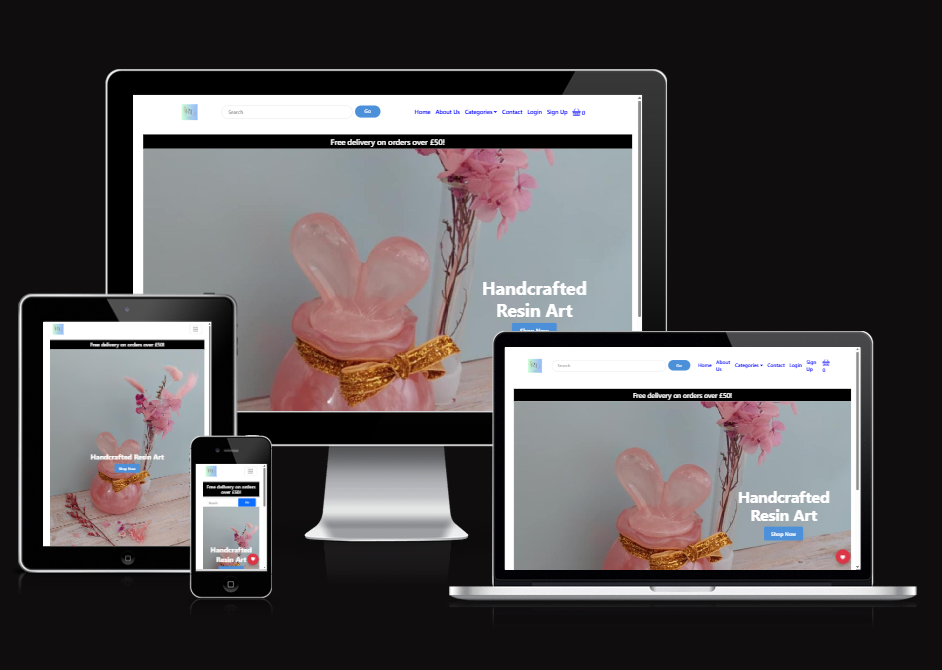

[View the live project here.](https://resin-treasures-2025-f7167892b201.herokuapp.com/)

## User Experience

### Project Overview
Resin Treasures is a full-stack Django e-commerce platform designed to offer handmade resin presents.
It provides users with a seamless shopping experience while offering the owner complete control over product listings, orders, and customer interactions.
This program is intended to expand with new features, including loyalty incentives, wishlists, and personalised user accounts.

### Goals & Challenges
- Build a secure and user-friendly shopping platform
- Allow users to easily register, shop, and manage their profiles
- Introduce a loyalty stamp card to encourage repeat purchases
- Implement a wishlist feature for product saving
- Ensure smooth category filtering and product search

### Target Users
- Shoppers looking for unique handmade resin gifts
- Users who want to track their purchases and loyalty progress
- Customers who prefer saving items for later use with wishlists
- The shop owner who manages the inventory and orders
- Customers who prefer saving items for later use with wishlists
- The shop owner who manages the inventory and orders

## User Stories

### Authentication & User Profiles
- As a new user, I want to register for an account so I can make purchases and access my profile.
- As a returning user, I want to log in and out securely to protect my account.
- As a user, I want to view and edit my profile so I can keep my information up to date.
- As a user, I want to delete my account to remove all my data.

### Shopping & Checkout
- As a user, I want to browse products by category so I can easily find what I’m looking for.
- As a user, I want to search for products using a search bar so I can quickly find specific items.
- As a user, I want to view detailed product information before buying.
- As a user, I want to add products to my basket and update quantities.
- As a user, I want to remove items from my basket.
- As a user, I want to proceed to checkout and make a payment securely.
- As a user, I want to receive confirmation after placing an order.

### Wishlist
- As a user, I want to add items to my wishlist to save them for later.
- As a user, I want to view and manage my wishlist from my profile.
- As a user, I want to remove items I no longer want from my wishlist.

### Newsletter
- As a visitor, I want to enter my email address and subscribe to the newsletter, so that I can receive updates about new products and offers.
- As a visitor, I want to receive a confirmation email when I subscribe, so that I know my subscription was successful.
- As a visitor, I want to see a success message on the site after subscribing, so that I know my action was completed.
- As a visitor, I want to be notified if my email is already subscribed, so that I don’t accidentally subscribe multiple times.
- As a visitor, I want to be informed if my email address is invalid, so that I can correct it before submitting.
- As a subscriber, I want the ability to unsubscribe easily via a link in emails, so that I can stop receiving updates if I’m no longer interested.
- As a subscriber, I want a confirmation email or message after unsubscribing, so that I know I won’t receive further newsletters.
- As a site admin, I want to view a list of all subscribed emails, so that I can understand my audience and target communications.
- As a site admin, I want to prevent fake or temporary emails from subscribing, so that the newsletter reaches real users.
- As a site admin, I want to export subscriber emails (e.g., to CSV), so that I can use them in external marketing tools.

### Admin & Store Management
- As the site owner, I want to add, update, or delete product listings to manage my store inventory.
- As the site owner, I want to create and manage product categories to keep the store organized.
- As the site owner, I want to view and fulfill customer orders.
- As the site owner, I want to receive and respond to messages from the Contact form.

### Static Pages & Contact
- As a user, I want to visit the About page to learn about the store and its owner.
- As a user, I want to use a Contact form to ask questions or request custom orders.

## Features

### Authentication & User Accounts
- User registration and login
- Logout and delete account options
- Secure password handling
- User profile page with order history

### Shopping Experience
- Browse products by category
- Search bar for product lookup
- Detailed product pages with images and descriptions
- Add to basket and update quantities
- Full checkout process with confirmation

### Wishlist
- Add or remove items from wishlist
- View saved products in the user profile

### Newsletter
- Email subscription form
- Confirmation email when subscribed
- Duplicate and invalid email detection
- Unsubscribe link in emails
- Admin view of subscribers
- Export subscribers to CSV

### Admin Management
- Add, update, and delete products
- Manage categories and orders from the admin dashboard

### Static Pages
- About Me page to share the creator's story
- Contact Me form for customer queries

# Wireframes

Wireframes were created during the planning stage to illustrate the structure and layout of Resin Treasures' key pages. 
These low-fidelity designs helped visualise user flow, prioritise critical elements, and ensure a consistent and user-friendly experience throughout the site. 
Each wireframe depicts a key aspect of the application, such as the home page, product listing, product detail view, user profile, Wishlist, basket, checkout, and contact pages. 
The wireframes served as the foundation for creating easy navigation, clear calls-to-action, and a clean, accessible design that appealed to both new and returning customers.

### Desktop View

Login Page - Desktop

Registration Page - Desktop

Home Page - Desktop

About Page - Desktop

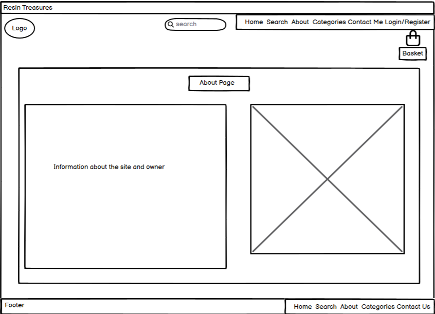

Category Page - Desktop

Basket Page - Desktop

Profile Page - Desktop

Checkout Page - Desktop

Payment Page - Desktop

Complete Page - Desktop

### Mobile View

Login Page - Mobile

Registration Page - Mobile

Home Page - Mobile

About Page - Mobile

Category Page - Mobile

Basket Page - Mobile

Profile Page - Mobile

Checkout Page - Mobile

Payment Page - Mobile

Complete Page - Mobile

Contact Page - Mobile

## Design & Branding  

### **Logo**

The Resin Treasures logo evokes a sense of artisanal elegance and quiet wonder. At its heart, the initials "RT" are rendered in a graceful serif font, standing tall and timeless—an emblem of refinement and craftsmanship. Encircling the monogram is a rope-like border, subtly textured to suggest both strength and softness. Delicate floral motifs bloom on either side, hinting at nature’s influence and the organic beauty of resin artistry.

The background transitions gently from a soft green to a tranquil blue, echoing the calming hues of sea glass and forest light. Beneath the initials, the brand name RESIN TREASURES appears in spaced-out, minimalist lettering—grounding the design with clarity and intention.

This logo represents a brand that values detail, respects nature, and invites its audience into a world of handcrafted serenity.

### **Colour Scheme**  

Resin Treasures uses a soft, elegant colour palette that reflects the handmade, creative, and gift-focused nature of the store. The scheme is designed to provide a calm and welcoming shopping experience while ensuring strong readability and accessibility.

Primary Colour – Classic Blue (#0000FF)
Used for navigation links and brand elements. This bold, timeless blue evokes trust and clarity, anchoring the site with a sense of reliability and digital craftsmanship.

Button Colour – Soft Sky Blue (#4C90DA)
Applied to primary call-to-action buttons like “Shop Now.” This gentle blue feels inviting and modern, guiding users with warmth and confidence.

Button Hover – Deep Indigo Blue (#3571B8)
A slightly darker shade is used on hover states to signal interactivity without overwhelming the user. It adds depth and responsiveness to the interface.

Secondary Background – Clean White (#FFFFFF)
Used across the navbar and hero sections to maintain a fresh, minimal canvas that lets resin products shine.

Neutral Text – Charcoal Grey (#333333)
Provides strong readability for body text and subtle contrast against the brighter blues, ensuring accessibility and visual balance.

#### Why This Palette?

The combination of classic blue, soft sky tones, and clean neutrals creates a user experience that’s both intuitive and emotionally safe. It mirrors the artisanal nature of resin gifts while offering a modern, trustworthy interface. Buttons feel like gentle invitations, not demands—perfect for a brand built on care, creativity, and quiet delight.

### **Typography** 

Resin Treasures uses a thoughtful pairing of two fonts — Playfair Display and Open Sans — to reflect both artisanal elegance and modern readability throughout the site.

Playfair Display. This refined serif font brings a sense of timeless craft and sophistication. With its high contrast and graceful curves, it’s perfect for headings, hero sections, and branding elements that need a poetic, handmade touch—echoing the delicate artistry of resin creations.

Open Sans: A clean, versatile sans-serif font that’s friendly and highly legible. Used for body text, navigation, and buttons, Open Sans ensures clarity across all devices while maintaining a soft, approachable tone that complements the gift-focused nature of the platform.

Together, these fonts strike a balance between elegance and ease — one expressive and craft-inspired, the other smooth and practical — enhancing the user experience with both emotional resonance and functional clarity.

##### Page Layout & Features:

The page layout for *Resin Treasures* is calm, curated, and visually inviting, designed to guide users gently through the shopping experience. It features a responsive, grid-based structure with generous spacing and soft visual cues.

#### **Header Section**

- **Text:** "Handcrafted Resin Art"  
  Large, bold, and aligned to the right in the hero section.

- **Subtext:** "Free delivery on orders over £50!"  
  Smaller, friendly message placed above the main call-to-action.

#### **Hero Section**

- Full-screen background image featuring resin art and floral accents.
- A “Shop Now” button in soft blue (`#4C90DA`) with rounded corners and white text.
- Button hover effect darkens to `#3571B8` for gentle interactivity.

#### **Main Content – Product Grid**

Products are displayed in a clean, multi-column grid layout. Each item includes:

- A high-quality image of the resin piece.
- Product name and price in clear, readable fonts.
- Optional “Add to Basket” button with coral or blue accent depending on context.

This layout prioritizes emotional clarity and visual breathing room—ensuring users feel welcomed, not overwhelmed.

### **Images & Visuals**  

#### **Registration Page**

The *Resin Treasures* registration page is designed with clarity, warmth, and user trust at its core. It offers a clean, intuitive interface that welcomes new users into the brand’s sanctuary of handcrafted beauty.

#### **Header Banner**

- A sleek black banner at the top displays the message:  
  **"Free delivery on orders over £50!"**  
  This sets a friendly, value-driven tone right from the start.

#### **Form Structure**

- **Heading:** *Create Account* — centered and bold, inviting users to begin their journey.
- **Input Fields:**
  - First Name
  - Surname
  - Email (pre-filled for admin preview)
  - Password
  - Confirm Password  
  Each field is clearly labeled and spaced for ease of use.

#### **Password Guidance**

Below the password fields, a helpful checklist outlines the requirements:

- At least one uppercase letter (A–Z)  
- At least one lowercase letter (a–z)  
- At least one number (0–9)  
- At least one special character (!@#$%^&*)  
- Minimum 8 characters  

This ensures security while gently guiding users through the process.

#### **Call to Action**

- A soft blue **Register** button (`#4C90DA`) with white text and rounded corners encourages completion.
- A subtle hover effect darkens the button to `#3571B8`, signaling interactivity without pressure.
- Beneath the button, a link reads:  
  **"Already have an account? Login here"** — offering a clear path for returning users.

**Why This Matters**

The registration page isn’t just functional—it’s an invitation. With thoughtful spacing, accessible design, and emotionally safe language, it reflects *Resin Treasures’* commitment to user care and artisanal clarity.

#### **Login Page**

The *Resin Treasures* login page offers a simple, secure, and welcoming interface for returning users. Designed with clarity and ease in mind, it reflects the brand’s commitment to trust and user comfort.

#### **Form Structure**

- **Username Field**  
  Clearly labeled and placed at the top for intuitive access.

- **Password Field**  
  Includes a “Show” button to toggle visibility, supporting accessibility and user control.

- **Login Button**  
  A large, soft blue button (`#4C90DA`) with white text and rounded corners.  
  On hover, the button gently darkens to `#3571B8`, signaling interactivity without pressure.

#### **Additional Prompt**

- Below the login button, a friendly message reads:  
  **"Don't have an account? Register here"**  
  The “Register here” link is clickable, guiding new users toward account creation with ease.

#### **Visual Design**

- Background: Light blue, offering a calm and clean visual experience.
- Layout: Centered form with generous spacing, ensuring readability and emotional clarity.

**Why This Matters**

The login page isn’t just a gateway—it’s a moment of reconnection. With thoughtful design and gentle cues, it invites users back into the *Resin Treasures* experience with warmth and trust.

#### **Navagation Bar**

### Logged-out Desktop Navigation Bar

The *Resin Treasures* desktop navigation bar is designed to be clear, elegant, and emotionally intuitive—guiding users gently through the site with ease and trust.

#### **Structure & Elements**

- **Logo**  
  A circular emblem featuring the initials **RT**, positioned on the far left. It anchors the brand visually and adds a handcrafted touch.

- **Search Bar**  
  Centered beside the logo, with a placeholder text: `"Search"`  
  Accompanied by a soft blue **Go** button (`#4C90DA`) for quick access to products and content.

- **Navigation Links**  
  Aligned to the right in a clean horizontal row:
  - Home  
  - About Us  
  - Categories  
  - Contact  
  - Login  
  - Sign Up  
  Each link is styled in classic blue (`#0000FF`) with hover effects in soft indigo (`rgb(107, 126, 235)`), offering visual feedback without distraction.

- **Shopping Cart Icon**  
  Positioned next to the “Sign Up” link, signaling e-commerce functionality and easy access to the user’s basket.

#### **Design Principles**

- **Layout**: Responsive and evenly spaced, ensuring clarity across screen sizes.
- **Color**: Blue accents convey trust and consistency, while a white background maintains a clean, breathable aesthetic.
- **Typography**: Medium-weight sans-serif fonts (`font-weight: 500; font-size: 18px`) for readability and emotional warmth.

The navigation bar isn’t just a menu—it’s a moment of orientation. It reflects *Resin Treasures’* commitment to user comfort, clarity, and handcrafted elegance from the very first click.

### Logged-In Desktop Navigation Bar

The *Resin Treasures* desktop navigation for logged-in users is designed to feel personal, polished, and emotionally intuitive—offering returning customers a seamless way to explore, manage, and shop with confidence.

#### **Structure & Elements**

- **Logo**  
  A circular emblem featuring the initials **KM**, set against a soft gradient of light blue and green. It anchors the brand with a sense of calm and artisanal identity.

- **Search Bar**  
  Positioned beside the logo with the placeholder `"Search"` and a soft blue **Go** button (`#4C90DA`). It invites users to explore with ease and intention.

- **Navigation Links**  
  Aligned to the right in a clean horizontal row, styled in classic blue (`#0000FF`):
  - Home  
  - About Us  
  - Categories ⌄ *(dropdown menu for product types)*  
  - Contact  
  - My Account ⌄ *(dropdown menu for profile, orders, settings)*  

  Each link is spaced for clarity and includes hover effects in soft indigo (`rgb(107, 126, 235)`), offering gentle feedback without visual noise.

- **Shopping Cart Icon**  
  Positioned at the far right, showing the current item count. It provides quick access to the user’s basket while maintaining visual harmony.

#### **Design Principles**

- **Color Palette:** Blue accents convey trust and consistency, while the gradient background adds a touch of serenity and craft.
- **Typography:** Medium-weight sans-serif fonts (`font-weight: 500; font-size: 18px`) for readability and emotional warmth.
- **Layout:** Responsive and evenly spaced, ensuring clarity across screen sizes and devices.

The logged-in desktop navigation reflects *Resin Treasures’* commitment to user care, personalization, and handcrafted elegance. It’s not just a menu—it’s a moment of orientation, connection, and quiet delight.

### Logged-Out Mobile Navigation

The *Resin Treasures* mobile navigation is designed to be intuitive, elegant, and emotionally attuned—offering users a calm entry point into the site, even on smaller screens.

#### **Top Section**

- **Logo:**  
  A circular emblem featuring the initials **RT** with the word *LIFESTYLE* beneath, framed by a decorative rope and floral motif. It anchors the brand with artisanal charm and visual identity.

- **Hamburger Menu Icon:**  
  Positioned to the right of the logo, the three-line icon opens the vertical navigation menu. It’s minimal and familiar, ensuring ease of use across devices.

#### **Navigation Menu (Expanded)**

Displayed vertically in soft blue text (`#0000FF`) for clarity and consistency:

- Home  
- About Us  
- Categories ⌄ *(dropdown indicator)*  
- Contact  
- Login  
- Sign Up  

Each link is spaced for touch-friendly interaction and emotional clarity.

#### **Cart Preview**

- A shopping cart icon appears at the bottom of the menu.
- Displays item count (e.g., `0`) to gently inform users of their basket status.

#### **Design Notes**

- **Color Palette:** Light blue background with blue text for a clean, breathable feel.
- **Typography:** Medium-weight sans-serif for readability and warmth.
- **Spacing:** Generous padding ensures no element feels cramped or overwhelming.

The mobile navigation reflects *Resin Treasures’* commitment to accessibility, emotional ease, and handcrafted elegance. Even in compact form, it invites users into a space of clarity, care, and creative exploration.

### Logged-In Mobile Navigation

The *Resin Treasures* mobile navigation for logged-in users is designed to feel personal, intuitive, and emotionally safe—offering returning customers a seamless way to explore, manage, and shop with ease.

#### **Top Section**

- **Logo:**  
  A circular emblem featuring the initials **RJ** with the word *LUXEARE* beneath, framed by a decorative rope and floral motif. It reinforces brand identity with a handcrafted, lifestyle-inspired aesthetic.

- **Hamburger Menu Icon:**  
  Positioned to the right of the logo, the familiar three-line icon opens the vertical navigation menu. It’s touch-friendly and visually unobtrusive.

#### **Navigation Menu (Expanded)**

Displayed vertically in classic blue text (`#0000FF`) for consistency and clarity:

- Home  
- About Us  
- Categories ⌄ *(dropdown indicator)*  
- Contact  
- My Account ⌄ *(dropdown indicator for profile, orders, settings)*  

Each item is spaced for easy tapping and emotional clarity, with dropdowns offering deeper access to personalized features.

#### **Cart Preview**

- A shopping cart icon appears at the bottom of the menu.
- Displays item count (e.g., `0`) to gently inform users of their basket status.

#### **Design Notes**

- **Color Palette:** Light blue background with blue text for a clean, breathable feel.
- **Typography:** Medium-weight sans-serif for readability and warmth.
- **Spacing:** Generous padding ensures no element feels cramped or overwhelming.

The logged-in mobile navigation reflects *Resin Treasures’* commitment to user care, personalization, and emotional clarity. It’s not just functional—it’s a quiet invitation to continue exploring, creating, and connecting.

### Home Page

The *Resin Treasures* home page is a gentle invitation into a world of handcrafted beauty. Designed to evoke calm, curiosity, and trust, it blends visual elegance with intuitive navigation—welcoming users into a curated shopping experience.

#### **Header & Navigation**

- A clean top navigation bar includes:
  - Logo with brand initials
  - Search bar with `"Search"` placeholder and soft blue **Go** button (`#4C90DA`)
  - Links to: Home, About Us, Categories ⌄, Contact, Login, and Sign Up
  - A shopping cart icon for quick access to basket contents

- Above the navigation bar, a banner reads:  
  **"Free delivery on orders over £50!"**  
  This sets a friendly, value-driven tone at first glance.

#### **Hero Section**

- A full-width promotional area featuring:
  - A pink resin art piece shaped like bunny ears, adorned with a golden ribbon
  - Soft floral accents to enhance the handcrafted aesthetic
  - Headline: **"Handcrafted Resin Art"** in elegant serif typography
  - A “Shop Now” button in soft blue (`#4C90DA`) with rounded corners and white text  
    - Hover effect darkens to `#3571B8` for gentle interactivity

#### **Design Principles**

- **Color Palette:** Pastel tones and soft blues create a calm, welcoming atmosphere
- **Typography:** A blend of serif and sans-serif fonts for emotional clarity and readability
- **Layout:** Generous spacing and visual breathing room guide users gently through the experience

The home page isn’t just a storefront—it’s a sanctuary. Every element is crafted to reflect *Resin Treasures’* values: care, creativity, and emotional clarity. It invites users to explore, connect, and discover the beauty of handmade resin art.

### About Page

The *Resin Treasures* About Page is a heartfelt introduction to the soul behind the studio—a one-woman creative space where resin art is crafted with care, intention, and emotional depth.

#### **Introduction**

> *"Welcome to Resin Treasures — a one-woman creative studio where handmade resin art comes to life."*

This opening sets the tone for the entire brand: personal, artisanal, and rooted in quiet craftsmanship. Visitors are invited into a small home studio in the UK, where every piece is designed, poured, and polished with love.

#### **About the Creator**

> *"Resin Treasures is a new and growing passion project, built from a love of crafting and a desire to create beautiful, meaningful keepsakes."*

This section shares the story of a solo maker who handles every step—from design and production to packing orders. It’s a labor of love, and the message is clear: every purchase supports a dream, not just a business.

#### **What I Make**

A curated list of offerings highlights the diversity and emotional intention behind each creation:

- Handmade jewellery — earrings and necklaces  
- Unique keyrings for all occasions  
- Thoughtful gifts for teachers and new parents  
- Custom animal and reptile-themed décor  

Each item is designed to be more than a product—it’s a keepsake, a gesture, a story.

#### **Visuals**

Three images showcase the resin-making process: molds, tools, and works-in-progress. These visuals reinforce the handmade nature of the brand and offer a glimpse into the quiet magic of creation.

The About Page isn’t just informational—it’s relational. It builds trust, invites connection, and reflects *Resin Treasures’* core values: care, creativity, and emotional clarity.

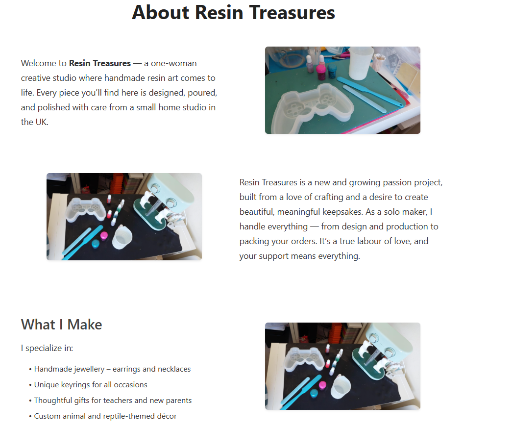

### Product Page

The *Resin Treasures* product page is a curated gallery of handcrafted resin art—each item presented with care, clarity, and emotional resonance. It’s designed to feel like browsing a boutique, where every piece tells a story.

#### **Top Navigation**

- Buttons for quick access:
  - **All Products**
  - **Categories**
  - **View All Reviews**
- A **Sort by...** dropdown on the right allows users to organize items by preference (e.g., price, popularity, or newest).

#### **Product Listings**

Each product is displayed in a clean, card-style layout with:

- **Image**: A high-quality photo showcasing the resin piece
- **Name**: Clear, descriptive titles
- **Description**: A short poetic summary that highlights the emotional and artistic qualities of the item
- **Price**: Displayed in GBP (£), reinforcing the handmade value
- **Buttons**:
  - **View Product** — for detailed information and close-up images
  - **Add to Basket** — styled in soft blue (`#4C90DA`) with white text and rounded corners

#### **Featured Items**

Examples include:

- **Rose Figurine** — A sculpted pink resin rose, romantic and delicate  
- **Dog and Girl Puzzle** — A 3-piece figurine capturing a tender moment  
- **Heart on Wheels Car** — A whimsical pink glittered car  
- **Glimmer Gills Axolotl** — A translucent pink axolotl with shimmering details

Each item is unique, reflecting the brand’s commitment to one-of-a-kind artistry.

#### **Design Principles**

- **Layout**: Multi-column grid for desktop, responsive stacking for mobile
- **Typography**: Serif headings for elegance, sans-serif body text for clarity
- **Color Palette**: Soft pastels and blues to evoke calm and trust

The product page isn’t just a catalogue—it’s a celebration of craft. It invites users to explore, connect, and discover pieces that feel personal, meaningful, and joyfully handmade.

### Contact Page

The *Resin Treasures* contact page is designed to feel personal, approachable, and emotionally safe—inviting visitors to reach out with curiosity, kindness, or creative ideas.

#### **Header Message**

> *"We’d love to hear from you — whether you’re shopping for a gift, requesting a custom piece, or simply saying hello."*

This gentle introduction sets the tone for open, heartfelt communication.

#### **Contact Form**

A clean, centered form includes:

- **Name** — text input  
- **Email Address** — text input  
- **Message** — large textarea for inquiries, feedback, or custom requests  
- **Submit Button** — soft blue (`#4C90DA`) with white text and rounded corners  
  - Hover effect: darkens to `#3571B8` for subtle interactivity

#### **Additional Info**

- **Response Time:** Typically within 1–2 business days  
- **Custom Requests:** Encouraged and welcomed—users can describe their ideas, themes, or preferred colours  
- **Support Tone:** Friendly, patient, and emotionally attuned

#### **Design Principles**

- **Color Palette:** Light blue background with soft accents for calm and clarity  
- **Typography:** Sans-serif fonts for readability and warmth  
- **Layout:** Generous spacing and mobile responsiveness ensure ease of use across devices

The contact page isn’t just a form—it’s a doorway. It reflects *Resin Treasures’* commitment to connection, care, and co-creation. Every message is received with gratitude and intention.

#### **Confirmation Message**

After submission, users receive a gentle green notification box:

> ✅ **Your message has been sent successfully!**

This reinforces trust and emotional clarity, letting users know their voice has been heard.

#### **Design Principles**

- **Color Palette:** Light blue background with soft accents for calm and clarity  
- **Typography:** Sans-serif fonts for readability and warmth  
- **Layout:** Generous spacing and mobile responsiveness ensure ease of use across devices

The contact page isn’t just a form—it’s a doorway to connection. It reflects *Resin Treasures’* values of care, creativity, and gratitude—making every message feel personal and appreciated.

### Contact Form Submission – Seller View

When a customer submits the contact form on *Resin Treasures*, the message is delivered directly to the seller’s inbox—ensuring prompt, personal communication.

#### **Email Notification**

- **Sender:** The message appears from the customer’s name and email address  
- **Subject Line:** `"Contact Form Submission from [Customer Name]"`  
- **Preview Text:** Displays a snippet of the message content for quick reference  
- **Status:** Marked as unread and highlighted for visibility

#### **Message Contents**

The email includes:

- **Customer Name**  
- **Email Address**  
- **Message Body** — whether it’s a question, custom request, or note of appreciation

This format ensures the seller has all the necessary details to respond with care and clarity.

#### **Tone & Experience**

Receiving a contact form is more than just a notification—it’s a moment of connection.  
Each message is treated with gratitude and intention, reflecting *Resin Treasures’* values of emotional clarity, handcrafted care, and personal attention.

Behind every submission is a person reaching out with curiosity, creativity, or kindness. The inbox becomes a quiet bridge between maker and admirer—turning digital contact into heartfelt conversation.

### Contact Form Submission – Email Example

When a customer submits a message through the *Resin Treasures* contact form, the seller receives an email notification with all relevant details. Below is a sample structure of the email content:

**Subject:**  
`Contact Form Submission from Louise Sykes`

**From:**  
`resintreasures5@gmail.com`  
*(on behalf of)* `louisestead@yahoo.co.uk`

**Message Body:**  
> *This is a message.*

**Buttons:**  
- **Reply** — to respond directly to the sender  
- **Forward** — to share the message with collaborators or support

Each email is a moment of connection—whether it’s a custom request, a kind note, or a question. The format ensures the seller can respond with care, clarity, and gratitude, continuing *Resin Treasures’* commitment to personal, emotionally attuned communication.

### My Account Dropdown Menu

The *Resin Treasures* account dropdown is designed to offer logged-in users a calm, intuitive way to manage their personal details, orders, and preferences. It reflects the brand’s commitment to emotional clarity and user empowerment.

#### **Dropdown Options**

When users click on **My Account**, a vertical menu appears with the following options:

- **Profile** — View and update your public-facing profile information  
- **Personal Details** — Edit your name, email, and password securely  
- **Order History** — Browse past purchases and track current orders  
- **Settings** — Customize preferences for communication and account behavior  
- **Logout** — Safely exit your account with one click

Each item is styled in classic blue (`#0000FF`) and spaced for touch-friendly interaction, with subtle hover effects in soft indigo (`rgb(107, 126, 235)`).

#### **Design Principles**

- **Color Palette:** Light background with blue text for clarity and consistency  
- **Typography:** Medium-weight sans-serif for readability and warmth  
- **Layout:** Vertical stack with generous spacing for ease of use on both desktop and mobile

The account dropdown isn’t just a menu—it’s a moment of control and care. It allows users to manage their experience with confidence, reflecting *Resin Treasures’* values of trust, transparency, and handcrafted attention.

### Profile Page

The *Resin Treasures* profile page offers a simple, secure, and emotionally clear space for users to view and manage their account details. It reflects the brand’s commitment to transparency, trust, and handcrafted care.

#### **Header**

> **My Profile**  
Displayed in large, bold text to anchor the page and affirm the user’s presence.

#### **Account Details**

- **Username:** ResinAdmin  
- **Email Address:** resintreasures5@gmail.com  

These fields are presented clearly, allowing users to confirm their login identity and contact information.

#### **Action Links**

Two clickable options are provided in soft blue text (`#0000FF`):

- **Edit Account Settings** — Allows users to update personal details, change passwords, or adjust preferences  
- **Logout** — A simple, secure way to exit the account

Both links are spaced for clarity and styled for intuitive interaction.

#### **Design Principles**

- **Color Palette:** Light background with blue accents for calm and clarity  
- **Typography:** Medium-weight sans-serif for readability and emotional warmth  
- **Layout:** Minimal and centered, ensuring ease of use across devices

The profile page isn’t just informational—it’s affirmational. It gives users a sense of ownership and emotional clarity, reinforcing *Resin Treasures’* values of care, transparency, and user-centered design.

### Account Settings Page

The *Resin Treasures* account settings page offers users a calm, intuitive space to manage their personal information, preferences, and privacy. Designed with emotional clarity and user empowerment in mind, it ensures every detail feels easy to update and securely handled.

#### **Navigation Tabs**

A horizontal menu allows users to switch between key account areas:

- **Personal Info** — Update name, email, and phone number  
- **Security** — Manage passwords and login credentials  
- **Payment** — Add or edit payment methods  
- **Notifications** — Choose how and when to receive updates  
- **Privacy** — Control data sharing and visibility preferences

Each tab is styled in soft blue (`#0000FF`) with clear hover feedback for ease of navigation.

#### **Personal Info Section**

When selected, the **Personal Info** tab displays:

- **Full Name** — text input  
- **Email Address** — text input  
- **Phone Number** — text input  
- **Save Changes** button — soft blue (`#4C90DA`) with white text and rounded corners  
  - Hover effect: darkens to `#3571B8` for gentle interactivity

#### **Design Principles**

- **Color Palette:** Light background with blue accents for calm and clarity  
- **Typography:** Medium-weight sans-serif for readability and warmth  
- **Layout:** Generous spacing and mobile responsiveness for ease of use across devices

The account settings page isn’t just functional—it’s affirmational. It gives users control over their experience while reflecting *Resin Treasures’* values of trust, transparency, and handcrafted care.

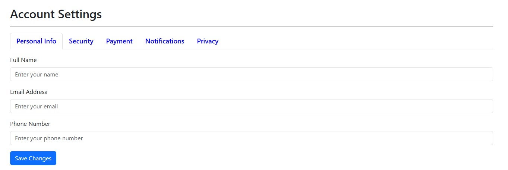

### Security Page

The *Resin Treasures* security page offers users a calm, intuitive space to manage their login credentials with confidence. Designed to prioritize emotional clarity and digital safety, it ensures that updating sensitive information feels simple and secure.

#### **Navigation Tabs**

Part of the broader **Account Settings** interface, the security tab sits alongside:

- Personal Info  
- Payment  
- Notifications  
- Privacy  

Each tab is styled in soft blue (`#0000FF`) and spaced for ease of navigation.

#### **Password Update Section**

When the **Security** tab is selected, users are presented with:

- **Current Password** — input field for verification  
- **New Password** — input field for the updated password  
- **Confirm New Password** — input field to ensure accuracy  
- **Update Password** button — styled in warm yellow with rounded corners  
  - Offers gentle visual contrast and signals a meaningful action

#### **Design Principles**

- **Color Palette:** Light background with blue and yellow accents for clarity and warmth  
- **Typography:** Sans-serif fonts for readability and emotional ease  
- **Layout:** Vertical stack with generous spacing for mobile and desktop responsiveness

The security page isn’t just a form—it’s a promise. It reflects *Resin Treasures’* commitment to user trust, privacy, and emotional safety. Every field is designed to feel empowering, not intimidating.

### Payment Section

The *Resin Treasures* payment section offers users a secure, minimal interface for managing how they pay—designed with emotional clarity and trust at its core.

#### **Navigation Context**

Part of the broader **Account Settings** interface, the **Payment** tab sits alongside:

- Personal Info  
- Security  
- Notifications  
- Privacy  

Each tab is styled in soft blue (`#0000FF`) and spaced for intuitive navigation.

#### **Payment Management**

When the **Payment** tab is selected, users see:

- A message:  
  > *"No payment methods saved yet."*  
  This gentle prompt encourages setup without pressure.

- **Add Payment Method** button — outlined in soft blue (`#4C90DA`) with rounded corners  
  - On click, users can enter card details or link a preferred payment option  
  - Designed for clarity, with secure input fields and confirmation feedback

#### **Design Principles**

- **Color Palette:** Light background with blue accents for calm and clarity  
- **Typography:** Sans-serif fonts for readability and emotional ease  
- **Layout:** Vertical stack with generous spacing for mobile and desktop responsiveness

The payment section isn’t just transactional—it’s relational. It reflects *Resin Treasures’* commitment to secure, emotionally safe commerce, where every detail is handled with care and intention.

### 🔔 Notifications Page

The *Resin Treasures* notifications page offers users a gentle, intuitive way to manage how they stay informed—designed with emotional clarity and respect for personal boundaries.

#### **Navigation Context**

Part of the broader **Account Settings** interface, the **Notifications** tab sits alongside:

- Personal Info  
- Security  
- Payment  
- Privacy  

Each tab is styled in soft blue (`#0000FF`) and spaced for ease of navigation.

#### **Notification Preferences**

Users are presented with two clear options:

- ✅ **Order updates by email** — checked by default, ensuring users receive important updates about their purchases  
- ⬜ **Promotional emails** — unchecked by default, allowing users to opt in only if they wish to receive offers or news

Each option is displayed with a checkbox and styled for clarity and accessibility.

#### **Save Preferences**

- A soft blue **Save Preferences** button (`#4C90DA`) with white text and rounded corners  
  - Hover effect: darkens to `#3571B8` for gentle interactivity  
  - Confirms changes with subtle feedback, reinforcing trust and control

#### **Design Principles**

- **Color Palette:** Light background with blue accents for calm and clarity  
- **Typography:** Sans-serif fonts for readability and emotional ease  
- **Layout:** Vertical stack with generous spacing for mobile and desktop responsiveness

The notifications page isn’t just about settings—it’s about consent. It reflects *Resin Treasures’* commitment to emotionally safe communication, giving users full control over how and when they’re contacted.

### Privacy Page

The *Resin Treasures* privacy page offers users a clear, respectful space to manage their data and account choices. It’s designed to reflect the brand’s commitment to safety, transparency, and emotional integrity.

#### **Navigation Context**

Part of the broader **Account Settings** interface, the **Privacy** tab sits alongside:

- Personal Info  
- Security  
- Payment  
- Notifications  

Each tab is styled in soft blue (`#0000FF`) and spaced for intuitive navigation.

#### **Account Deletion Option**

At the heart of the privacy page is a clear and respectful option for users who wish to leave the platform:

- **Delete Account** button — styled in bold red to signal importance and caution  
- **Warning Message:**  
  > *"This action is permanent and cannot be undone."*  
  This ensures users are fully informed before making a final decision.

The button is intentionally prominent, but not emotionally aggressive—designed to honor user autonomy without pressure.

#### **Design Principles**

- **Color Palette:** Light background with red and blue accents for clarity and emotional weight  
- **Typography:** Sans-serif fonts for readability and a calm tone  
- **Layout:** Vertical stack with generous spacing for mobile and desktop responsiveness

The privacy page isn’t just a setting—it’s a promise. It reflects *Resin Treasures’* belief in ethical design, user consent, and emotional safety. Whether users choose to stay or go, their autonomy is respected with care and clarity.

### Categories Dropdown Menu

The *Resin Treasures* categories dropdown offers users a calm, curated way to explore the full range of handcrafted resin creations. Designed for emotional clarity and ease of navigation, it gently guides users toward the pieces that speak to them.

#### **Dropdown Options**

When users hover over or tap **Categories**, a vertical menu appears with the following options:

- **All Products** — View the complete collection  
- **Animals** — Figurines and décor inspired by beloved creatures  
- **Baby Gifts** — Gentle keepsakes for new parents and little ones  
- **Christmas** — Festive resin art for seasonal joy  
- **Decor** — Home accents with handcrafted charm  
- **Gifts** — Thoughtful pieces for birthdays, milestones, and surprises  
- **Jars and Pots** — Functional art with a whimsical twist  
- **Teacher Gifts** — Heartfelt tokens of appreciation for educators

Each item is styled in soft blue (`#0000FF`) with hover effects in muted indigo (`rgb(107, 126, 235)`), offering gentle visual feedback.

#### **Design Principles**

- **Color Palette:** Light background with blue accents for calm and clarity  
- **Typography:** Medium-weight sans-serif for readability and warmth  
- **Layout:** Vertical stack with generous spacing for touch-friendly interaction

The categories dropdown isn’t just a menu—it’s a map. It reflects *Resin Treasures’* commitment to emotional clarity, handcrafted storytelling, and user-centered design—making exploration feel like discovery.

### Product Card – Rose Figurine

Each product card on *Resin Treasures* is designed to feel like a quiet invitation—presenting handcrafted pieces with clarity, warmth, and emotional resonance.

#### **Visual Layout**

- **Image**  
  A high-quality photo of the resin piece, centered and softly lit.  
  Example: A red resin rose with green stem and leaves, placed on a dark surface for contrast.

- **Title**  
  **Rose Figurine** — displayed in bold, medium-weight serif font for elegance

- **Price**  
  **£5.00** — clearly shown beneath the title in readable, calm typography

- **Description**  
  🌹 *Red Resin Rose Figurine*  
  > *This exquisite red resin rose captures timeless romance in sculptural form. Its delicately molded petals …*

  A short poetic summary that evokes the emotional and artistic qualities of the piece.

#### **Buttons**

- **View Product** — soft blue (`#4C90DA`) with white text and rounded corners  
  - Hover effect: darkens to `#3571B8` for gentle interactivity  
  - Leads to a detailed product page with more images and full description

- **Add to Basket** — styled similarly, offering a clear path to purchase  
  - Button placement ensures ease of use without visual clutter

#### **Design Principles**

- **Color Palette:** Pastel tones and soft blues to evoke calm and trust  
- **Typography:** Serif for titles, sans-serif for descriptions—balancing elegance and readability  
- **Spacing:** Generous padding around elements for emotional clarity and breathing room

Each product card is more than a listing—it’s a moment of storytelling. It reflects *Resin Treasures’* commitment to handcrafted beauty, emotional clarity, and a shopping experience that feels personal and poetic.

### View Product Page – Rose Figurine

The *Resin Treasures* product detail page transforms browsing into storytelling. Each handcrafted item is presented with emotional clarity, inviting users to pause, admire, and connect.

#### **Visual Layout**

- **Left Side:**  
  A high-resolution image of the resin piece, centered and softly lit.  
  Example: A red resin rose with green stem and leaves, placed on a dark surface to highlight its sculptural texture and romantic tones.

- **Right Side:**  
  - **Title:** *Rose Figurine*  
  - **Price:** **£5.00**  
  - **Color Selected:** Red  
  - **Description:**  
    > *This exquisite red resin rose captures timeless romance in sculptural form. Its delicately modeled petals unfurl with lifelike grace, each one etched in rich crimson tones that evoke passion and elegance. The stem and leaves—cast in vibrant green with textured detailing—anchor the rose in realism while adding contrast and depth. Whether gifted as a symbol of love or displayed as a decorative keepsake, this handcrafted bloom radiates enduring beauty and heartfelt sentiment.*

#### **Action Buttons**

- **Buy It Now** — soft blue (`#4C90DA`) with white text and rounded corners  
- **Add to Cart** — styled similarly for continuity and ease  
- **Wishlist Button** — a red circular icon with a heart, positioned near the product title  
  - Adds the item to the user’s wishlist with a single tap  
  - Designed to feel personal and emotionally expressive

- **← Back to Shop** — a subtle link at the bottom for gentle navigation

#### **Design Principles**

- **Color Palette:** Romantic reds, soft greens, and calming blues  
- **Typography:** Serif for titles and descriptions, sans-serif for buttons and labels  
- **Layout:** Balanced two-column structure with generous spacing and visual breathing room

The view product page isn’t just informational—it’s experiential. It reflects *Resin Treasures’* commitment to handcrafted storytelling, emotional clarity, and a shopping experience that feels like a quiet celebration of beauty.

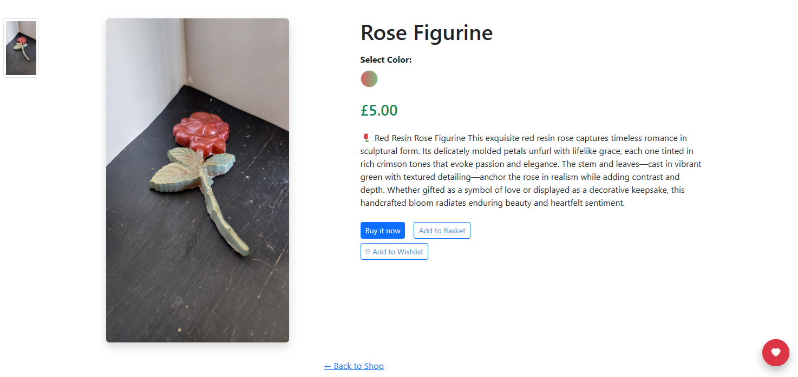

### Basket Page

The *Resin Treasures* basket page is designed to feel calm, clear, and emotionally reassuring—giving users a gentle overview of their selected items before checkout.

#### **Item Listing**

Each product added to the basket is displayed with:

- **Thumbnail Image** — a small preview of the resin piece  
- **Product Name** — e.g., *Rose Figurine*  
- **Selected Options** — e.g., *Color: Green and Red*  
- **Price** — e.g., **£5.00**  
- **Quantity Controls** — plus (+) and minus (–) buttons with a numerical field to adjust quantity

#### **Total Summary**

- **Total:** Displayed clearly beneath the item list  
  - Example: `Total: £5.00`  
  - Updates dynamically as quantities change

#### **Action Buttons**

- **Continue Shopping** — returns users to the product gallery  
- **Empty Basket** — clears all items with a single click  
- **Proceed to Checkout** — styled in soft blue (`#4C90DA`) with white text and rounded corners  
  - Hover effect: darkens to `#3571B8` for gentle interactivity

#### **Design Principles**

- **Color Palette:** Light background with blue accents for clarity and calm  
- **Typography:** Sans-serif fonts for readability and emotional ease  
- **Layout:** Vertical stack with generous spacing for mobile and desktop responsiveness

The basket page isn’t just a transaction—it’s a moment of reflection. It allows users to review their choices with clarity and care, reinforcing *Resin Treasures’* commitment to thoughtful, emotionally safe shopping.

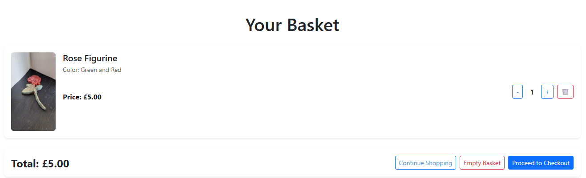

### Checkout Page

The *Resin Treasures* checkout page is designed to feel calm, clear, and emotionally safe—guiding users gently through the final step of their purchase with care and confidence.

#### **Left Side – Order Summary**

- **Header:** *Order Summary (1)*  
- **Product Listing:**  
  - Thumbnail image of the selected resin piece  
  - Product name and selected color (e.g., *Green and Red*)  
  - Quantity: 1  
  - Subtotal: **£5.00**

- **Delivery Method:**  
  - Dropdown menu to select preferred delivery option  
  - **Delivery Cost:** £0.00  
  - **Grand Total:** **£5.00**

- **Update Button:** Allows users to confirm or change delivery selections

#### **Right Side – Delivery Form**

> *"Please fill out the form below to complete your order"*

Fields include:

- Full Name  
- Email Address  
- House Name or Number  
- Street Address 1  
- Street Address 2  
- Town or City  
- Postal Code  
- Country  
- Phone Number  
- InPost Locker or Shop *(optional)*

- **Checkbox:**  
  > *"Save this delivery information to my profile"*  
  Allows returning users to streamline future purchases

#### **Design Principles**

- **Color Palette:** Soft blues and whites for calm and clarity  
- **Typography:** Sans-serif fonts for readability and emotional warmth  
- **Layout:** Two-column structure with generous spacing and mobile responsiveness

The checkout page isn’t just a transaction—it’s a moment of trust. It reflects *Resin Treasures’* commitment to handcrafted care, emotional clarity, and a shopping experience that feels personal, gentle, and secure.

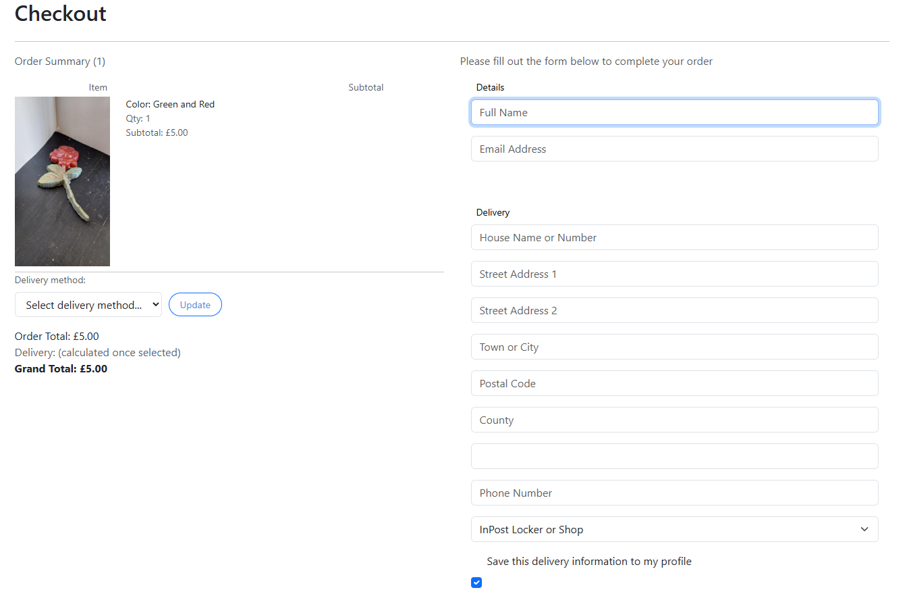

### Delivery Section – Checkout Page

The delivery section of the *Resin Treasures* checkout page is designed to feel clear, calm, and reassuring—guiding users gently through their shipping choices with transparency and trust.

#### **Delivery Method**

- **Dropdown Menu:**  
  Users can select from available delivery options, such as:  
  - *Home Delivery*  
  - *InPost Locker or Shop*  
  - *Local Pickup* *(if applicable)*

- **Update Button:**  
  A soft blue button (`#4C90DA`) allows users to confirm or change their selection.  
  - Hover effect: darkens to `#3571B8` for gentle interactivity

#### **Cost Breakdown**

- **Delivery Cost:** Clearly displayed beneath the selected method  
  - Example: `Delivery: £2.89`  
- **Order Total:** Item subtotal before shipping  
  - Example: `Order Total: £5.00`  
- **Grand Total:** Final cost including delivery  
  - Example: `Grand Total: £7.89`

Each figure is spaced for clarity and updated dynamically as selections change.

#### **Design Principles**

- **Color Palette:** Light background with blue accents for calm and clarity  
- **Typography:** Sans-serif fonts for readability and emotional ease  
- **Layout:** Vertical stack with generous spacing for mobile and desktop responsiveness

The delivery section isn’t just logistical—it’s relational. It reflects *Resin Treasures’* commitment to transparency, emotional clarity, and a shopping experience that feels thoughtful and trustworthy from start to finish.

### Complete Order Page

The *Resin Treasures* complete order page is the final, secure step in a heartfelt shopping journey—designed to feel calm, trustworthy, and emotionally affirming.

#### **Left Side – Order Summary**

- **Header:** *Order Summary (1)*  
- **Product:**  
  - *Rose Figurine – Green and Red*  
  - Quantity: 1  
  - Subtotal: **£5.00**  
- **Delivery Method:** *Home Delivery*  
  - Delivery Cost: **£2.89**  
- **Grand Total:** **£7.89**

This section offers a clear, itemized breakdown of the purchase, reinforcing transparency and trust.

#### **Right Side – Payment Form**

> *"Please fill out the form below to complete your order"*

Fields include:

- **Email Address**  
- **Card Information** — card number, expiration date, CVC  
- **Cardholder Name**  
- **Country or Region** — defaulted to *United Kingdom*  
- **Checkbox:**  
  > *"Save this delivery information to my profile"*  
  Allows for faster checkout in future visits

- **Security Note:**  
  > *Information is securely saved and encrypted*  
  This reinforces emotional safety and data protection

- **Pay Button:**  
  Styled in soft blue (`#4C90DA`) with white text and rounded corners  
  - Hover effect: darkens to `#3571B8` for gentle interactivity  
  - Finalizes the order with a single, confident click

#### **Design Principles**

- **Color Palette:** Soft blues and whites for calm and clarity  
- **Typography:** Sans-serif fonts for readability and emotional warmth  
- **Layout:** Two-column structure with generous spacing and mobile responsiveness

The complete order page isn’t just a transaction—it’s a moment of trust and transformation. It reflects *Resin Treasures’* commitment to handcrafted care, emotional clarity, and a shopping experience that feels personal, gentle, and secure.

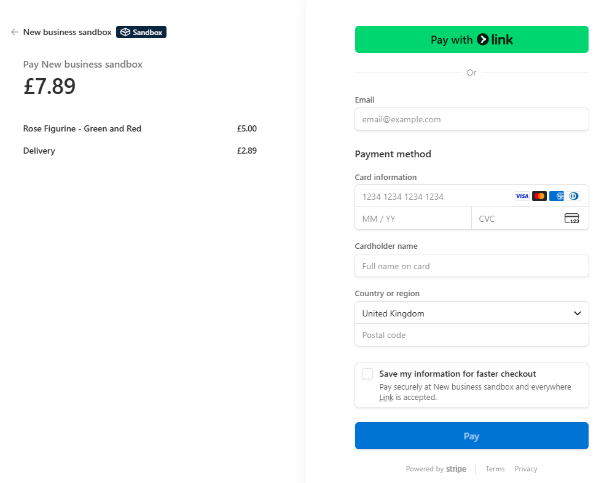

### Order Confirmation Page

The *Resin Treasures* order confirmation page is a quiet celebration of trust and connection—designed to affirm the successful completion of a heartfelt purchase with clarity, warmth, and gratitude.

#### **Header Message**

> ✅ **Payment Successful**  
> *Thank you for your order, Louise Sykes.*

This message is styled in green to signal success and emotional reassurance. It marks the transition from transaction to relationship.

#### **Order Details**

- **Order Number:** `#68`  
- **Delivery Address:**  
  Horbury  
  Wakefield, West Yorkshire  
  WF4 6JP  
  United Kingdom

- **Delivery Method:** *Home*  
- **Parcel Size:** *Small*  
- **Delivery Cost:** **£2.89**

Each detail is presented clearly, affirming transparency and care.

#### **Navigation**

- **Back to Home** — a soft blue button (`#4C90DA`) with rounded corners  
  - Allows users to return to the homepage gently and intuitively

#### **Design Principles**

- **Color Palette:** Soft greens and blues for calm and clarity  
- **Typography:** Sans-serif fonts for readability and emotional warmth  
- **Layout:** Vertical stack with generous spacing and mobile responsiveness

The order confirmation page isn’t just a receipt—it’s a thank-you note. It reflects *Resin Treasures’* commitment to handcrafted care, emotional clarity, and a shopping experience that feels personal, poetic, and deeply appreciated.

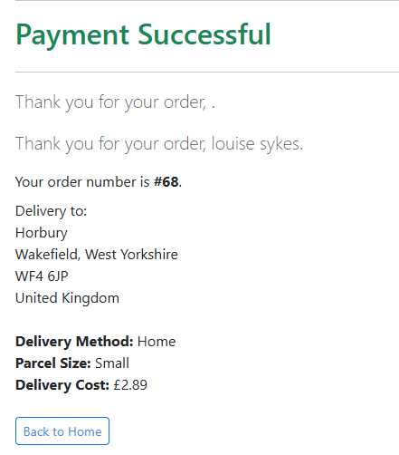

### Footer Section

The *Resin Treasures* footer is a quiet anchor at the bottom of each page—designed to offer support, connection, and gentle navigation. It reflects the brand’s commitment to emotional clarity, handcrafted care, and user trust.

#### **Customer Service**

A column dedicated to care and reassurance:

- **Contact Us** — for questions, custom requests, or kind hellos  
- **Delivery Information** — details on shipping methods and timelines  
- **Returns & Refunds** — policies written with empathy and fairness  
- **Help & FAQs** — answers to common questions with emotional clarity

#### **Shop**

A column for continued exploration:

- **All Products** — browse the full collection  
- **Categories** — curated by theme and occasion  
- **Wishlist** — revisit saved treasures

#### **Follow Us**

A column for gentle connection:

- **Facebook** — stay updated and inspired  
- **eBay** — explore listings and reviews  
  *(Each link includes a recognizable icon for visual clarity)*

#### **Stay Connected**

A column for quiet updates:

- **Email Input Field** — invite users to subscribe  
- **Subscribe Button** — soft blue (`#4C90DA`) with rounded corners  
  - Hover effect: darkens to `#3571B8` for gentle interactivity

#### **Footer Note**

> © Resin Treasures. All rights reserved.

This closing line grounds the site in professionalism while maintaining its handcrafted identity.

The footer isn’t just functional—it’s foundational. It reflects *Resin Treasures’* values of care, connection, and emotional clarity, offering users a gentle way to stay informed, supported, and inspired.

### Delivery Information

At *Resin Treasures*, every parcel is handled with care and clarity. Whether you're sending to a home address or an InPost Locker or Shop, our delivery options are designed to be transparent, affordable, and emotionally reassuring.

#### Sending to an InPost Locker or Shop

> *Drop off your parcel at an InPost Point, and we’ll deliver it to your recipient’s chosen location. They’ll receive updates and have 3 days to collect once it arrives.*

| Parcel Size | Dimensions (cm / in)             | Max Weight | Price |
|-------------|----------------------------------|------------|-------|
| Small       | 8 × 38 × 64 cm / 3 × 15 × 25 in   | 15kg       | £1.99 |
| Medium      | 19 × 38 × 64 cm / 7 × 15 × 25 in  | 15kg       | £2.99 |
| Large       | 41 × 38 × 64 cm / 16 × 15 × 25 in | 15kg       | £3.99 |

#### 🏡 Sending to a Home Address

> *Drop off your parcel at any InPost Point, and we’ll deliver it directly to your recipient’s home. Both you and the recipient will receive updates along the way.*

| Parcel Size | Dimensions (cm / in)             | Max Weight | Price |
|-------------|----------------------------------|------------|-------|
| Small       | 8 × 38 × 64 cm / 3 × 15 × 25 in   | 15kg       | £2.99 |
| Medium      | 19 × 38 × 64 cm / 7 × 15 × 25 in  | 15kg       | £3.99 |
| Large       | 41 × 38 × 64 cm / 16 × 15 × 25 in | 15kg       | £5.99 |

Delivery isn’t just logistics—it’s part of the experience. These options reflect *Resin Treasures’* commitment to transparency, affordability, and emotional clarity. Whether gifting or receiving, every parcel is a promise handled with care.

### Returns & Refunds Page

The *Resin Treasures* returns and refunds page is crafted with empathy and transparency—offering customers a clear, emotionally safe path for resolving issues with their orders.

#### **Eligibility**

- Items must be returned within **14 days** of receipt  
- Must be in **original condition** and packaging  
- **Sale items** are non-returnable  
- Damaged or broken returns may not be refunded  
- Return shipping is the **customer’s responsibility**

#### **Return Process**

1. Email `resinterresources@gmail.com` with your **order number** and reason for return  
2. Follow the provided instructions, including the **return address**  
3. Ship the item using a **tracked service** to ensure safe arrival

#### **Refunds**

- Issued to the **original payment method** once the item is received and inspected  
- Processing time: **7 working days**

#### **Exchanges**

- Accepted for different **sizes, colours, or products**  
- Contact us first to confirm **availability**  
- Subject to the same conditions as returns

#### **Faulty or Damaged Items**

- Must be reported within **48 hours** of receipt  
- Include a **photo of the damage**  
- A **replacement or refund** will be offered free of charge

#### **Shipping Costs for Returns**

- Customers are responsible for **return postage**  
- A **tracked service** is strongly recommended for peace of mind

The returns and refunds page isn’t just policy—it’s a promise. It reflects *Resin Treasures’* commitment to fairness, emotional clarity, and handcrafted care. Every resolution is handled with gratitude and respect.

### Help & FAQs Page

The *Resin Treasures* Help & FAQs page is designed to offer calm, clear answers to common questions—wrapped in a gentle, interactive experience that respects user focus and emotional clarity.

#### **Dropdown Behavior**

Each FAQ category is collapsible and behaves as a single-open accordion:

- When a user **clicks a category**, its questions and answers expand beneath it  
- If another category is clicked, the **previous one closes automatically**  
- This ensures the page remains tidy, focused, and emotionally uncluttered

#### **FAQ Categories**

- **Ordering**  
  - *How do I place an order?*  
    > Browse the shop, select items, add to basket, and checkout using your preferred payment method.  
  - *Can I change my order after placing it?*  
    > Changes are not guaranteed once submitted. Contact us immediately for adjustments.  
  - *Do you offer gift wrapping?*  
    > Yes, available at checkout for an additional fee.

- **Shipping & Delivery** *(collapsed by default)*  
- **Payments** *(collapsed by default)*  
- **Returns & Refunds** *(collapsed by default)*  
- **Other Questions** *(collapsed by default)*

Each section is styled in soft blue headers (`#4C90DA`) with smooth transitions and generous spacing for readability.

#### **Design Principles**

- **Color Palette:** Soft blues and whites for calm and clarity  
- **Typography:** Sans-serif fonts for readability and emotional ease  
- **Layout:** Accordion-style dropdowns with only one section open at a time

The Help & FAQs page isn’t just informational—it’s intentional. It reflects *Resin Treasures’* commitment to emotional clarity, handcrafted care, and a support experience that feels gentle, focused, and reassuring.

### Wishlist Page – Items Added

The *Resin Treasures* wishlist page is a quiet corner of the shop—where admiration lives before commitment. It allows users to save treasures for later, revisit favorites, and reflect on what brings them joy.

#### **Header & Navigation**

- **Page Title:** *My Wishlist*  
- **Back to Shop Button:**  
  A soft blue link (`← back to Shop`) in the top left corner, offering gentle navigation back to browsing

#### **Wishlist Items**

Each saved item is displayed in a clean card layout with:

- **Thumbnail Image** — showcasing the resin piece with clarity and charm  
- **Title** — e.g., *Blue Diamond-Cut Jar*, *Car*, *Dogs with Heart Puzzle*  
- **Price** — clearly displayed beneath the title  
  - Example: *£9.00*, *£5.00*, *£8.00*

- **Buttons:**
  - **View Product** — styled in soft blue (`#4C90DA`) with white text and rounded corners  
    - Leads to the full product detail page  
  - **Remove** — allows users to gently declutter their wishlist

#### **Design Principles**

- **Color Palette:** Pastel tones and soft blues to evoke calm and trust  
- **Typography:** Serif for titles, sans-serif for buttons and labels  
- **Layout:** Responsive grid with generous spacing and visual breathing room

The wishlist isn’t just a feature—it’s a feeling. It reflects *Resin Treasures’* commitment to emotional clarity, handcrafted storytelling, and a shopping experience that honors pause, preference, and quiet delight.

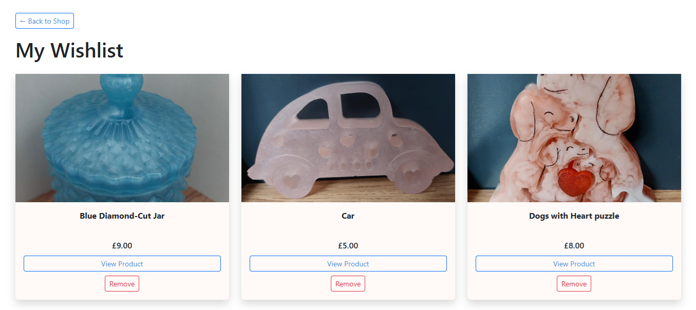

### Wishlist Page – Empty State

The *Resin Treasures* wishlist page, when empty, offers a soft pause—a gentle reminder that the journey of discovery is just beginning.

#### **Header & Message**

- **Page Title:** *My Wishlist*  
- **Message:**  
  > *Your wishlist is empty.*  
  This line is styled in soft grey, offering quiet clarity without judgment.

#### **Navigation**

- **← Back to Shop** — a soft blue link in the top left corner  
  - Encourages users to return to browsing with ease and intention

#### **Design Principles**

- **Color Palette:** Light background with muted tones for emotional calm  
- **Typography:** Sans-serif fonts for readability and warmth  
- **Layout:** Minimal and centered, with generous spacing for breathing room

An empty wishlist isn’t a void—it’s an invitation. It reflects *Resin Treasures’* belief in slow discovery, emotional clarity, and the joy of finding something worth saving.

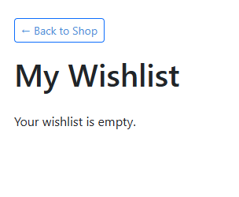

### Wishlist Button

The wishlist button is a small, circular icon designed to feel personal and expressive—inviting users to save items they love with a single, intuitive tap.

#### **Visual Design**

- **Shape:** Perfect circle  
- **Color:** Solid red background (`#FF0000`)  
- **Icon:** White heart centered within the circle  
  - The heart symbolizes affection, preference, and emotional connection  
- **Shadow:** Subtle drop shadow gives the button a soft, three-dimensional lift

#### **Behavior**

- **Tap to Save:** Adds the item to the user's wishlist  
- **Visual Feedback:** May animate or change state to confirm the action  
- **Placement:** Typically near product titles or images for easy access

#### **Emotional Intent**

This button isn’t just functional—it’s expressive. It reflects *Resin Treasures’* commitment to emotionally resonant design, allowing users to mark items they admire without pressure or urgency.

### Newsletter Section

The *Resin Treasures* newsletter is a quiet thread of connection—offering subscribers gentle updates, behind-the-scenes glimpses, and first looks at new handcrafted pieces. It’s designed to feel like a letter from a friend, not a broadcast.

#### **Stay Connected**

- **Email Input Field** — a single-line field inviting users to enter their email  
  - Placeholder text: *Enter your email to receive gentle updates*  
- **Subscribe Button** — soft blue (`#4C90DA`) with rounded corners  
  - Hover effect: darkens to `#3571B8` for subtle interactivity  
  - Text: *Subscribe*

#### **Tone & Promise**

> *No spam. No pressure. Just occasional notes filled with resin magic, gifting ideas, and stories from the studio.*

This message is placed just below the form, offering emotional reassurance and clarity.

#### **Design Principles**

- **Color Palette:** Soft pastels and blues to evoke calm and trust  
- **Typography:** Sans-serif fonts for readability and warmth  
- **Layout:** Centered with generous spacing, designed to feel like a pause, not a pitch

The newsletter isn’t just a marketing tool—it’s a moment of care. It reflects *Resin Treasures’* commitment to slow commerce, emotional clarity, and a community built on trust, not urgency.

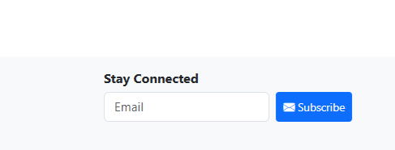

### Newsletter Confirmation Message

After a user subscribes to the *Resin Treasures* newsletter, a soft confirmation message appears—designed to feel like a quiet thank-you, not a transactional alert.

#### **Message Display**

- **Background:** Light green, signaling success and calm  
- **Text:**  
  > *Thank you for subscribing. A confirmation email has been sent.*  
  This message is styled in medium-weight sans-serif, centered for clarity

- **Dismiss Icon:**  
  A subtle “X” on the right side allows users to close the message gently

#### **Design Principles**

- **Color Palette:** Soft greens and whites for emotional reassurance  
- **Typography:** Sans-serif fonts for readability and warmth  
- **Layout:** Horizontal banner with centered text and right-aligned dismiss icon

The confirmation message isn’t just feedback—it’s a gesture of gratitude. It reflects *Resin Treasures’* commitment to emotionally safe communication, where every interaction feels personal, gentle, and appreciated.

### Newsletter Confirmation Email

After a user subscribes to the *Resin Treasures* newsletter, they receive a gentle welcome email—designed to feel like a handwritten note from the studio, not a corporate broadcast.

#### **Sender & Subject Line**

- **From:** `resintrainees@signi...`  
- **Subject:** *Welcome to Resin Treasures*  
- **Preview Text:**  
  > *Hi there! Thanks for subscribing to Resin Treasures. You’ll now be the first...*

This message appears in the **Primary** inbox tab, marked with a soft purple label and a circular “R” icon for brand recognition.

#### **Email Body (Tone & Content)**

> *Hi there!*  
> *Thanks for subscribing to Resin Treasures. You’ll now be the first to hear about new arrivals, studio stories, and gifting ideas crafted with care.*

- A warm greeting and gentle affirmation  
- A promise of emotionally resonant updates—not spam  
- Optional link to **browse the shop** or **update preferences**

#### **Design Principles**

- **Color Palette:** Soft pastels and whites for calm and clarity  
- **Typography:** Serif headings for elegance, sans-serif body for warmth  
- **Layout:** Mobile-friendly, with generous spacing and visual breathing room

The confirmation email isn’t just a receipt—it’s a welcome. It reflects *Resin Treasures’* commitment to slow commerce, emotional clarity, and a community built on care, not urgency.

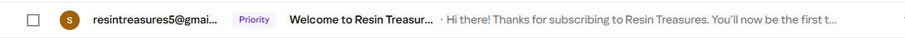

### Newsletter Welcome Email

The *Resin Treasures* welcome email is a soft, heartfelt note—sent moments after a new subscriber joins the mailing list. It’s designed to feel personal, warm, and quietly celebratory.

#### **Sender & Subject Line**

- **From:** `resintreasures5@gmail.com`  
- **Subject:** *Welcome to Resin Treasures!*  
- **Sent:** Thursday, August 28 at 13:50  
- **Inbox Tab:** Primary (marked with a circular “R” icon)

#### **Email Body**

> *Hi there!*  
> *Thanks for subscribing to Resin Treasures. You’ll now be among the first to hear about our latest creations, exclusive offers, and studio updates—crafted with care and sent with love.*  
>  
> *We’re so glad you’re here.*  
>  
> — *The Resin Treasures Team*

This message is styled with soft spacing, serif headings, and a gentle tone—designed to feel like a handwritten note from the studio.

#### **Design Principles**

- **Color Palette:** Soft whites and pastels for calm and clarity  
- **Typography:** Serif for headings, sans-serif for body text  
- **Layout:** Mobile-friendly with generous breathing room

The welcome email isn’t just a confirmation—it’s an invitation. It reflects *Resin Treasures’* commitment to slow commerce, emotional clarity, and a community built on care, not urgency.

### Gallery of Reflections – Review Page

The *Gallery of Reflections* is more than a review page—it’s a quiet space for emotional resonance. Each reflection is treated as a ripple in the waters, inviting users to explore beauty, meaning, and connection through shared experiences.

#### Layout & Structure

- **Page Title:** *Gallery of Reflections*  
- **Subtitle:**  
  > *Each review is a ripple in the waters – explore values in beauty, meaning, and connection.*

- **Filter Controls:**  
  - Dropdowns for *All Products* and *All Ratings*  
  - A **Filter** button to refine displayed entries

#### 💬 Review Cards

Each product reflection is displayed in a soft card layout featuring:

- **Product Name** — e.g., *Car*, *Dog and Girl 9-Piece Puzzle Figurine*  
- **Rating** — displayed as stars (e.g., 4 out of 5)  
- **Reflection Text** — user-submitted thoughts, e.g.,  
  > *"Lovely little car" — JenniferSmith*  
  > *"What did this piece mean to you?" — KevinAdams*

- **Your Review Indicator** — reflections authored by the current user are labeled  
- **Text Box** — allows users to write a new reflection  
- **Respond Button** — styled in soft blue (`#4C90DA`) for gentle interaction

#### Design Principles

- **Color Palette:** Soft neutrals and pastels to evoke calm and emotional safety  
- **Typography:** Serif for reflections, sans-serif for labels and buttons  
- **Layout:** Vertical stack with generous spacing and visual breathing room

The review page isn’t just feedback—it’s a dialogue. It reflects *Resin Treasures’* commitment to emotionally literate design, where every voice is honored and every reflection deepens the story of each handcrafted piece.

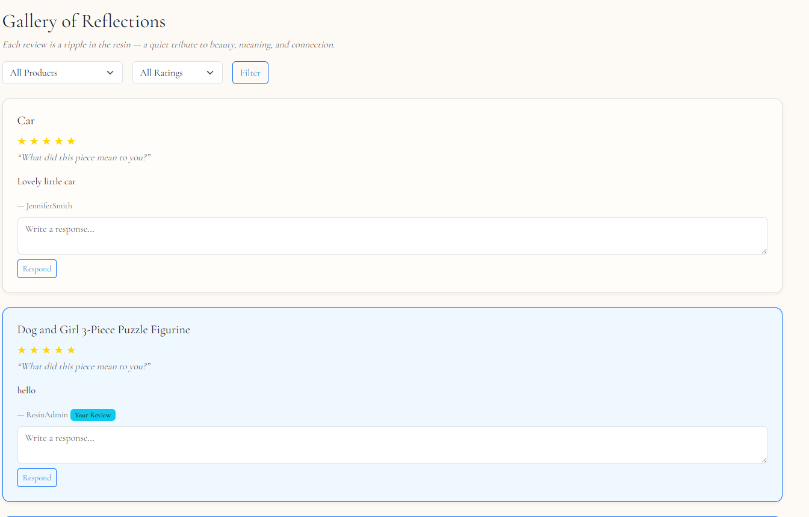

### Review by Product – Gallery of Reflections

The *Review by Product* feature allows users to filter reflections based on specific resin pieces—creating a quiet space where each item’s emotional impact can be explored in depth.

#### Filter Controls

- **Dropdown Menu: All Products**  
  Users can select a specific item to view only its associated reflections.  
  Available options include:

  - All Products  
  - Car  
  - Owl Wall Figurine  
  - Crystal Tray  
  - Dogs with Heart Puzzle  
  - Rose Figurine  
  - Sea Turtle  
  - Axolotl Figurine  
  - Christmas Candle Holders  
  - Blue Diamond-Cut Jar  
  - Golden Autumn Leaf Tray  
  - Personalized Pet Hanging Frame  
  - Handprint Ornaments  
  - Dog and Girl 3-Piece Puzzle Figurine  
  - Dragon  
  - Lizard Wall Ornament – Sunset Spectrum  
  - Purple Tray – "Elegance in Profile"

- **Dropdown Menu: All Ratings**  
  Allows users to filter reflections by star rating (e.g., 5-star only)

- **Filter Button**  
  Applies the selected filters with a soft transition, maintaining emotional clarity and visual calm

#### Filtered Reflections

Once a product is selected, the page displays:

- **Product Name & Image**  
- **User Reflections** — each one a personal note of meaning or connection  
- **Rating** — shown as stars  
- **Text Box** — for new reflections  
- **Respond Button** — styled in soft blue (`#4C90DA`) for gentle interaction

#### Design Principles

- **Color Palette:** Soft neutrals and pastels to evoke calm and emotional safety  
- **Typography:** Serif for reflections, sans-serif for labels and buttons  
- **Layout:** Vertical stack with generous spacing and visual breathing room

Reviewing by product isn’t just about feedback—it’s about honoring the emotional resonance of each handcrafted piece. It reflects *Resin Treasures’* commitment to slow reflection, shared meaning, and a shopping experience rooted in care.

### Review by Rating – Gallery of Reflections

The *Review by Rating* feature allows users to filter reflections based on emotional resonance—expressed through star ratings. It’s a quiet way to explore how deeply each piece has touched others.

#### Filter Controls

- **Dropdown Menu: All Ratings**  
  Users can select a specific rating to view only reflections that match that level of sentiment.  
  Available options include:

  - All Ratings  
  - 1 Star  
  - 2 Stars  
  - 3 Stars  
  - 4 Stars  
  - 5 Stars

- **Filter Button**  
  Applies the selected rating filter with a soft transition, maintaining visual calm and emotional clarity

#### Filtered Reflections

Once a rating is selected, the page displays:

- **Product Name & Image**  
- **User Reflections** — filtered by the chosen star rating  
- **Rating Display** — shown as stars  
- **Text Box** — for new reflections  
- **Respond Button** — styled in soft blue (`#4C90DA`) for gentle interaction

#### Design Principles

- **Color Palette:** Soft neutrals and pastels to evoke calm and emotional safety  
- **Typography:** Serif for reflections, sans-serif for labels and buttons  
- **Layout:** Vertical stack with generous spacing and visual breathing room

Reviewing by rating isn’t just about sorting—it’s about listening. It reflects *Resin Treasures’* commitment to emotionally literate design, where every star is a story, and every reflection deepens the connection between giver and gift.

### **Accessibility**

Accessibility has been a key focus during the development of *Resin Treasures*, ensuring that all users—including those with disabilities—can comfortably navigate and enjoy the website. Several strategies were implemented to create an inclusive, emotionally safe experience:

**Text Contrast**

- **High Contrast:** The site follows the Web Content Accessibility Guidelines (WCAG) by maintaining strong contrast between text and background elements, making content easier to read for users with visual impairments such as low vision or color blindness.

- **Color Scheme:** A soft, handcrafted palette is used thoughtfully, with careful attention to contrast ratios. This ensures that all text remains legible and content stands out clearly against background colors without overwhelming the senses.

**Alt Text for Images**

- **Descriptive Alt Text:** All images across the website—including product photos, category icons, and decorative elements—feature meaningful alternative (alt) text. This provides helpful descriptions for users who rely on screen readers or have images disabled.

- **Contextual Relevance:** Alt text is kept concise yet descriptive, helping users understand the purpose and content of each image without visual input.

**Keyboard Navigation Support**

- **Keyboard Accessibility:** The site is fully navigable using a keyboard alone. Users can move through links, buttons, and form fields using the Tab key, and activate them using the Enter key.

- **Focus Indicators:** Clear visual focus indicators (such as outline borders or soft glows) are provided to show which element is currently selected, helping users who navigate without a mouse.

- **Accessible Forms:** All forms—including login, checkout, newsletter subscription, and contact forms—are properly labeled and structured to be easily usable with a keyboard and assistive technologies.

By implementing these features, *Resin Treasures* aims to provide a welcoming, inclusive experience for all users—where handcrafted beauty and emotional clarity are accessible to everyone, regardless of ability.

## Database & Backend

### Data Structure & Relationships

#### Database Design Process

The database for **Resin Treasures** was carefully structured to provide a secure, scalable, and user-friendly shopping experience.  
The design process followed three key phases:

1. **Requirements Analysis** – Identifying the needs of both customers and the store owner  
2. **Data Structuring** – Defining tables and their relationships (products, orders, users, etc.)  
3. **Normalisation** – Reducing redundancy, ensuring consistency, and maintaining integrity  

#### Requirements Analysis

The database was designed to support the following core functionalities:

- Users can register, manage profiles, and log in securely.  
- Users can browse products, add items to a basket, and complete a checkout process.  
- Orders are stored with customer, shipping, and payment details.  
- Users can save items for later using a **wishlist**.  
- A **newsletter system** stores email subscribers.  
- Admins can manage products, categories, and fulfil customer orders.  

#### Data Tables & Core Entities

Each major feature is represented by a dedicated table:

| Entity            | Purpose                                                                 |
|-------------------|-------------------------------------------------------------------------|
| **User**          | Stores user authentication and profile information                     |
| **Product**       | Stores product details such as name, description, price, and stock     |
| **Category**      | Groups products into categories for easy navigation                    |
| **Order**         | Stores order information, including user, shipping, and payment status  |
| **OrderItem**     | Tracks individual products within an order                             |
| **Basket**        | Temporary storage of the user’s selected items before checkout             |
| **Wishlist**      | Stores products users have saved for later                             |
| **Newsletter**    | Stores email addresses of subscribers for marketing campaigns          |
| **ContactMessage**| Captures messages submitted via the contact form                       |

#### Relationships Between Tables

- **One-to-Many**:
  - A **User** can place many **Orders**
  - An **Order** can contain many **OrderItems**
  - A **Category** can include many **Products**
  - A **User** can have many **Wishlist** items

- **Many-to-Many**:
  - A **User** can add many **Products** to their Wishlist, and a **Product** can appear in many users' Wishlists  
  *(Implemented via the Wishlist table)*

#### Entity Relationship Diagram (ERD)

The ERD below visualises how the main entities relate:

ERD

#### Normalisation for Integrity

The database is normalised up to the **Third Normal Form (3NF)**:

- **1NF**: Each field contains atomic values (e.g., product name, price, stock are stored separately).  
- **2NF**: All non-key attributes fully depend on the primary key (e.g., an OrderItem depends on its unique order reference, not partially).  
- **3NF**: No transitive dependencies between non-key attributes (e.g., category names are stored only in the Category table and referenced via foreign keys).  

This ensures efficiency, reduces redundancy, and maintains data integrity across the platform.

### Backend Architecture

#### Technologies Used

| Tool           | Purpose                                   |
|----------------|--------------------------------------------|
| **Django**     | Backend framework with ORM and admin panel |
| **PostgreSQL** | Relational database                        |
| **Cloudinary** | Media storage for product images           |
| **Heroku**     | Hosting and deployment                     |
| **Gunicorn**   | WSGI server for Heroku                     |
| **Stripe**     | Payment processing for secure checkout     |

#### Key Models

| Model          | Description                                                        |
|----------------|--------------------------------------------------------------------|
| **User**       | Django’s built-in auth system for customers and store owner        |
| **Product**    | Stores product details including name, description, price, and stock |
| **Category**   | Organizes products into groups (e.g., Jewellery, Keyrings, Decor)  |
| **Order**      | Stores user orders including shipping info and Stripe session data |
| **OrderItem**  | Line items for each order, linking products with quantity & price  |
| **Wishlist**   | Tracks products users save for later                               |
| **Newsletter** | Stores email addresses subscribed to updates                       |

#### Model Field Types

- `CharField` – Names, titles, email addresses  
- `TextField` – Product descriptions and additional details  
- `DecimalField` – Prices and totals  
- `ImageField` / `CloudinaryField` – For storing product images  
- `ForeignKey` – One-to-many relationships (e.g., category → product, order → items)  
- `ManyToManyField` – Many-to-many (e.g., user ↔ wishlist items)  
- `EmailField` – For newsletter subscriptions and user accounts

### Data Flow

The diagram below shows how data flows through the **Resin Treasures** platform, from browsing products to completing an order and receiving notifications.

Data Flow Diagram

flowchart LR
    A[User] -->|Browse| B[(Product Catalogue)]
    A -->|Search / Filter| B
    A -->|Add to Basket| C[(Basket)]
    C -->|Proceed to Checkout| D[(Checkout Form)]
    D -->|Payment| E[Stripe API]
    E -->|Success| F[(Order Confirmation)]
    F -->|Save| G[(Order Database)]
    A -->|Subscribe| H[(Newsletter DB)]
    G -->|Email| I[Confirmation Email]
    H -->|Email| J[Newsletter Email]

### Views & URLs

#### Core E-commerce Views
- Browse products by category or search
- View detailed product pages
- Add, update, and remove items from the basket
- Proceed through checkout and complete secure payment
- Subscribe to the newsletter
- Contact the shop owner

#### User Account Views
- Register a new account
- Log in and log out securely
- Manage user profile (update details, view past orders)
- Delete account if desired

#### Admin Views
- Add, edit, and delete products
- Manage categories
- View and fulfill orders
- Access contact form submissions

#### URL Patterns (Examples)

- `/` – Homepage  
- `/about/` – About Resin Treasures  
- `/products/` – All products  
- `/products/category/<slug>/` – Filter products by category  
- `/basket/` – View and manage shopping basket  
- `/checkout/` – Secure checkout process  
- `/profile/` – User profile and order history  
- `/newsletter/subscribe/` – Subscribe to newsletter  
- `/contact/` – Contact form  

### User Authentication & Permissions

- Built on Django’s **User Authentication system**
- **Permissions**:
  - Registered users: place orders, manage profile, add to wishlist
  - Guests: browse products and add to basket (checkout requires account)
  - Admins: manage products, categories, and orders via Django admin

### Security Measures

- **Passwords**: Securely hashed via Django’s built-in system  
- **HTTPS**: Enforced through Heroku with SSL  
- **Cloudinary**: Secure storage for static and media files  
- **CSRF Protection**: Enabled by default in Django  
- **SQL Injection / XSS**: Prevented via Django ORM and validation  
- **Stripe**: PCI-compliant secure payments  

### Deployment

The backend is deployed on **Heroku** with the following setup:

- **Database**: PostgreSQL (Heroku add-on)  
- **Media Hosting**: Cloudinary for static and uploaded images  
- **Environment Variables**: Configured via Heroku Config Vars  
- **Scalability**: Optimised queries and ready for dyno scaling  

 _For full deployment instructions, see the `DEPLOYMENT.md` file._

### Logging & Monitoring

- **Error Tracking**: Planned integration with **Sentry** for real-time monitoring  
- **Development Debugging**: Django Debug Toolbar  
- **Production Monitoring**: Heroku logs for request and error tracking  

### Languages & Technologies

- **HTML5** – Structure of all pages  
- **CSS3** – Styling and responsive design  
- **Python** – Core backend language  
- **Django** – Web framework for backend logic and ORM  
- **Heroku** – Cloud hosting and deployment platform  
- **PostgreSQL** – Relational database for products, orders, and users  

### Frameworks, Libraries & Programs

- **Bootstrap 5** – Frontend framework for responsive layout and styling  
- **Hover.css** – Smooth hover transitions (e.g., social icons)  
- **Google Fonts** – Typography with *Quicksand* font across the site  
- **Font Awesome** – Icon library for visual enhancements  
- **jQuery** – Used alongside Bootstrap for navbar and interactive UI elements  
- **Stripe** – Secure payment processing integration  
- **Git** – Version control, with commits made in Gitpod and pushed to GitHub  
- **GitHub** – Repository hosting for the project’s source code  
- **Heroku** – Cloud platform used for live deployment  
- **Cloudinary** – Media storage for images and static files  
- **Balsamiq** – Wireframing tool for initial design planning  
- **Lucidchart** – Diagrams and flowcharts for database and app structure  

## Future Features

To further improve **Resin Treasures**, the following features are planned:

- **👤 Enhanced User Profiles:** Ability for customers to view past orders and manage saved addresses.  
- **🛍️ Wishlist:** Customers can save favorite products to purchase later.  
- **🔍 Search & Filters:** Improved filtering by price, category, and product type.  
- **📧 Newsletter Enhancements:** Automated campaigns and personalized offers.  
- **⭐ Reviews & Ratings:** Customers can leave feedback on products.  
- **📦 Order Tracking:** Real-time order status updates for customers.  
- **📤 Social Sharing:** Quick share options for products to Instagram, Facebook, and Pinterest.  
- **🛠️ Admin Dashboard:** Enhanced tools for managing orders, users, and inventory.  

These improvements aim to make **Resin Treasures** an even more engaging and customer-friendly online shop for handmade resin art.  

### Project Status

**Resin Treasures** is fully functional with its core e-commerce features in place — customers can browse products, add items to their basket, and securely checkout.  
Future updates will focus on enhancing customer experience with features like wishlists, order tracking, and improved product filtering.

## Credits

### Code

[Bootstrap 5](https://getbootstrap.com/docs/5.3.3/getting-started/introduction/): Used throughout the project to provide a responsive, mobile-first layout with the Bootstrap Grid System.  

### Content

All content was written by the developer.  

The newsletter setup and automation were assisted with [ChatGPT](https://chatgpt.com/).  

### Media

- All product and workshop images were created by the developer.  
- Icons sourced from [Font Awesome](https://fontawesome.com/).  

---

### Reviews 

**Emma W** – “Absolutely love my resin keyring! The colours are stunning and it feels so unique. Delivery was quick and beautifully packaged — you can really tell the care that goes into each piece.”  

**James P** – “Bought a necklace as a gift, and my partner was over the moon. The craftsmanship is excellent, and it feels so much more personal than something mass-produced.”  

**Chloe S** – “I’ve ordered twice no,w and each time the quality has been amazing. I really appreciate the little thank-you note that came with my order — such a lovely touch.”  

**Hannah R** – “The site is easy to use, and checkout was smooth. The product photos matched exactly what I received, and honestly, it looks even better in person!”  

**Lauren K** – “Beautiful handmade art with so much attention to detail. I love supporting small businesses and Resin Treasures is one of my new favourites.”  

### Acknowledgements

I’d like to thank the following resources and communities that supported the development and inspiration of **Resin Treasures**:

- **[Bootstrap 5](https://getbootstrap.com/)** – For providing the responsive grid system and components that helped shape the site’s layout.  
- **[Django Documentation](https://docs.djangoproject.com/)** – An invaluable resource for building and structuring the backend.  
- **[Cloudinary](https://cloudinary.com/)** – For hosting and managing media files seamlessly.  
- **[Font Awesome](https://fontawesome.com/)** – For the icons used throughout the site.  
- **[Google Fonts](https://fonts.google.com/)** – For the *Quicksand* font that gives the site its clean, modern feel.  
- **[ChatGPT](https://chatgpt.com/)** – For support in writing, structuring, and testing features such as the newsletter setup.
- **[Copilot](https://copilot.microsoft.com/)** – Helped write the descriptions for the sellers items.   
- **Open Source Community** – Countless tutorials, Stack Overflow answers, and GitHub repositories that guided the way.  

And of course, a huge thank you to the early supporters of **Resin Treasures**, whose feedback and encouragement helped bring this project to life.

My Mentor for continuous helpful feedback.

Tutor support at Code Institute for their support.

Family and Friends for feedback.

