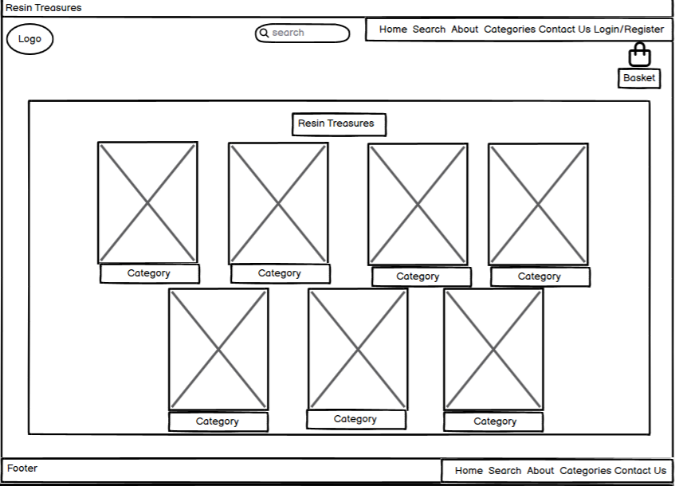

# Resin-Treasures

## User Experience

### Project Overview
Resin Treasures is a full-stack Django e-commerce platform designed to offer handmade resin presents.
It provides users with a seamless shopping experience while offering the owner complete control over product listings, orders, and customer interactions.
This program is intended to expand with new features, including loyalty incentives, wishlists, and personalised user accounts.

### Goals & Challenges
- Build a secure and user-friendly shopping platform

- Allow users to easily register, shop, and manage their profiles

- Introduce a loyalty stamp card to encourage repeat purchases

- Implement a wishlist feature for product saving

- Ensure smooth category filtering and product search

### Target Users

- Shoppers looking for unique handmade resin gifts

- Users who want to track their purchases and loyalty progress

- Customers who prefer saving items for later using wishlists

- The shop owner who manages the inventory and orders
  
- Customers who prefer saving items for later using wishlists

- The shop owner who manages the inventory and orders

## User Stories

### Authentication & User Profiles

- As a new user, I want to register for an account so I can make purchases and access my profile.

- As a returning user, I want to log in and out securely to protect my account.

- As a user, I want to view and edit my profile so I can keep my information up to date.

- As a user, I want to delete my account to remove all my data.

### Shopping & Checkout

- As a user, I want to browse products by category so I can easily find what I’m looking for.

- As a user, I want to search for products using a search bar so I can quickly find specific items.

- As a user, I want to view detailed product information before buying.

- As a user, I want to add products to my basket and update quantities.

- As a user, I want to remove items from my basket.

- As a user, I want to proceed to checkout and make a payment securely.

- As a user, I want to receive confirmation after placing an order.

### Loyalty Card System

- As a user, I want to earn a stamp each time I place an order.

- As a user, I want to view my loyalty stamp progress in my profile.

- As a user, I want to be notified when I unlock a reward.

### Wishlist

- As a user, I want to add items to my wishlist to save them for later.

- As a user, I want to view and manage my wishlist from my profile.

- As a user, I want to remove items I no longer want from my wishlist.

### Admin & Store Management

- As the site owner, I want to add, update, or delete product listings to manage my store inventory.

- As the site owner, I want to create and manage product categories to keep the store organized.

- As the site owner, I want to view and fulfill customer orders.

- As the site owner, I want to receive and respond to messages from the Contact form.

### Static Pages & Contact

- As a user, I want to visit the About page to learn about the store and its owner.

- As a user, I want to use a Contact form to ask questions or request custom orders.

## Features

### Authentication & User Accounts
- User registration and login
- Logout and delete account options
- Secure password handling
- User profile page with order history

### Shopping Experience
- Browse products by category
- Search bar for product lookup
- Detailed product pages with images and descriptions
- Add to basket and update quantities
- Full checkout process with confirmation

### Wishlist
- Add or remove items from wishlist
- View saved products in user profile

### Loyalty Card
- Users earn a stamp after every successful order
- Track stamps and rewards on profile

### Admin Management
- Add, update, and delete products
- Manage categories and orders from admin dashboard

### Static Pages
- About Me page to share the creator's story
- Contact Me form for customer queries

# Wireframes

Wireframes were built during the planning stage to show the structure and layout of Resin Treasures' essential pages. 
These low-fidelity designs assisted in visualising user flow, prioritising critical elements, and ensuring a consistent and user-friendly experience throughout the site. 
Each wireframe depicts a key aspect of the application, such as the home page, product listing, product detail view, user profile, Wishlist, basket, checkout, and contact pages. 
The wireframes served as the foundation for creating easy navigation, clear calls-to-action, and a clean, accessible design that appealed to both new and returning customers.

Login Page - Desktop

Registration Page - Desktop

Home Page - Desktop

About Page - Desktop

Category Page - Desktop

Basket Page - Desktop

Profile Page - Desktop

Checkout Page - Desktop

Payment Page - Desktop

Complete Page - Desktop

Contact Page - Desktop

