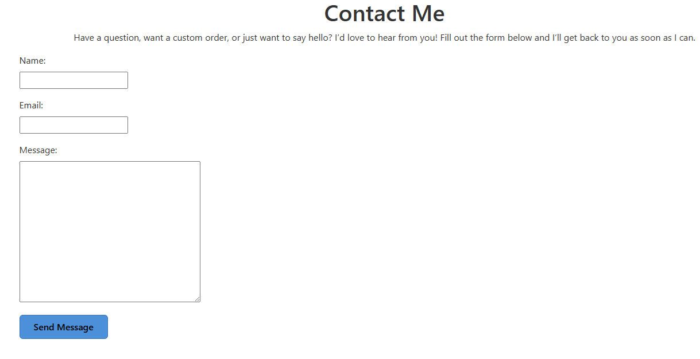

# Resin-Treasures

## User Experience

### Project Overview
Resin Treasures is a full-stack Django e-commerce platform designed to offer handmade resin presents.
It provides users with a seamless shopping experience while offering the owner complete control over product listings, orders, and customer interactions.
This program is intended to expand with new features, including loyalty incentives, wishlists, and personalised user accounts.

### Goals & Challenges
- Build a secure and user-friendly shopping platform
- Allow users to easily register, shop, and manage their profiles
- Introduce a loyalty stamp card to encourage repeat purchases
- Implement a wishlist feature for product saving
- Ensure smooth category filtering and product search

### Target Users
- Shoppers looking for unique handmade resin gifts
- Users who want to track their purchases and loyalty progress
- Customers who prefer saving items for later use with wishlists
- The shop owner who manages the inventory and orders
- Customers who prefer saving items for later use with wishlists
- The shop owner who manages the inventory and orders

## User Stories

### Authentication & User Profiles
- As a new user, I want to register for an account so I can make purchases and access my profile.
- As a returning user, I want to log in and out securely to protect my account.
- As a user, I want to view and edit my profile so I can keep my information up to date.
- As a user, I want to delete my account to remove all my data.

### Shopping & Checkout
- As a user, I want to browse products by category so I can easily find what I’m looking for.
- As a user, I want to search for products using a search bar so I can quickly find specific items.
- As a user, I want to view detailed product information before buying.
- As a user, I want to add products to my basket and update quantities.
- As a user, I want to remove items from my basket.
- As a user, I want to proceed to checkout and make a payment securely.
- As a user, I want to receive confirmation after placing an order.

### Wishlist
- As a user, I want to add items to my wishlist to save them for later.
- As a user, I want to view and manage my wishlist from my profile.
- As a user, I want to remove items I no longer want from my wishlist.

### Newsletter
- As a visitor, I want to enter my email address and subscribe to the newsletter, so that I can receive updates about new products and offers.
- As a visitor, I want to receive a confirmation email when I subscribe, so that I know my subscription was successful.
- As a visitor, I want to see a success message on the site after subscribing, so that I know my action was completed.
- As a visitor, I want to be notified if my email is already subscribed, so that I don’t accidentally subscribe multiple times.
- As a visitor, I want to be informed if my email address is invalid, so that I can correct it before submitting.
- As a subscriber, I want the ability to unsubscribe easily via a link in emails, so that I can stop receiving updates if I’m no longer interested.
- As a subscriber, I want a confirmation email or message after unsubscribing, so that I know I won’t receive further newsletters.
- As a site admin, I want to view a list of all subscribed emails, so that I can understand my audience and target communications.
- As a site admin, I want to prevent fake or temporary emails from subscribing, so that the newsletter reaches real users.
- As a site admin, I want to export subscriber emails (e.g., to CSV), so that I can use them in external marketing tools.

### Admin & Store Management
- As the site owner, I want to add, update, or delete product listings to manage my store inventory.
- As the site owner, I want to create and manage product categories to keep the store organized.
- As the site owner, I want to view and fulfill customer orders.
- As the site owner, I want to receive and respond to messages from the Contact form.

### Static Pages & Contact
- As a user, I want to visit the About page to learn about the store and its owner.
- As a user, I want to use a Contact form to ask questions or request custom orders.

## Features

### Authentication & User Accounts
- User registration and login
- Logout and delete account options
- Secure password handling
- User profile page with order history

### Shopping Experience
- Browse products by category
- Search bar for product lookup
- Detailed product pages with images and descriptions
- Add to basket and update quantities
- Full checkout process with confirmation

### Wishlist
- Add or remove items from wishlist
- View saved products in the user profile

### Newsletter
- Email subscription form
- Confirmation email when subscribed
- Duplicate and invalid email detection
- Unsubscribe link in emails
- Admin view of subscribers
- Export subscribers to CSV

### Admin Management
- Add, update, and delete products
- Manage categories and orders from the admin dashboard

### Static Pages
- About Me page to share the creator's story
- Contact Me form for customer queries

# Wireframes

Wireframes were created during the planning stage to illustrate the structure and layout of Resin Treasures' key pages. 
These low-fidelity designs helped visualise user flow, prioritise critical elements, and ensure a consistent and user-friendly experience throughout the site. 
Each wireframe depicts a key aspect of the application, such as the home page, product listing, product detail view, user profile, Wishlist, basket, checkout, and contact pages. 
The wireframes served as the foundation for creating easy navigation, clear calls-to-action, and a clean, accessible design that appealed to both new and returning customers.

### Desktop View

Login Page - Desktop

Registration Page - Desktop

Home Page - Desktop

About Page - Desktop

Category Page - Desktop

Basket Page - Desktop

Profile Page - Desktop

Checkout Page - Desktop

Payment Page - Desktop

Complete Page - Desktop

### Mobile View

Login Page - Mobile

Registration Page - Mobile

Home Page - Mobile

About Page - Mobile

Category Page - Mobile

Basket Page - Mobile

Profile Page - Mobile

Checkout Page - Mobile

Payment Page - Mobile

Complete Page - Mobile

Contact Page - Mobile

## Design & Branding  

### **Logo**

The Resin Treasures logo evokes a sense of artisanal elegance and quiet wonder. At its heart, the initials "RT" are rendered in a graceful serif font, standing tall and timeless—an emblem of refinement and craftsmanship. Encircling the monogram is a rope-like border, subtly textured to suggest both strength and softness. Delicate floral motifs bloom on either side, hinting at nature’s influence and the organic beauty of resin artistry.

The background transitions gently from a soft green to a tranquil blue, echoing the calming hues of sea glass and forest light. Beneath the initials, the brand name RESIN TREASURES appears in spaced-out, minimalist lettering—grounding the design with clarity and intention.

This logo represents a brand that values detail, respects nature, and invites its audience into a world of handcrafted serenity.

### **Colour Scheme**  

Resin Treasures uses a soft, elegant colour palette that reflects the handmade, creative, and gift-focused nature of the store. The scheme is designed to provide a calm and welcoming shopping experience while ensuring strong readability and accessibility.

Primary Colour – Classic Blue (#0000FF)
Used for navigation links and brand elements. This bold, timeless blue evokes trust and clarity, anchoring the site with a sense of reliability and digital craftsmanship.

Button Colour – Soft Sky Blue (#4C90DA)
Applied to primary call-to-action buttons like “Shop Now.” This gentle blue feels inviting and modern, guiding users with warmth and confidence.

Button Hover – Deep Indigo Blue (#3571B8)
A slightly darker shade is used on hover states to signal interactivity without overwhelming the user. It adds depth and responsiveness to the interface.

Secondary Background – Clean White (#FFFFFF)
Used across the navbar and hero sections to maintain a fresh, minimal canvas that lets resin products shine.

Neutral Text – Charcoal Grey (#333333)
Provides strong readability for body text and subtle contrast against the brighter blues, ensuring accessibility and visual balance.

#### Why This Palette?

The combination of classic blue, soft sky tones, and clean neutrals creates a user experience that’s both intuitive and emotionally safe. It mirrors the artisanal nature of resin gifts while offering a modern, trustworthy interface. Buttons feel like gentle invitations, not demands—perfect for a brand built on care, creativity, and quiet delight.

### **Typography** 

Resin Treasures uses a thoughtful pairing of two fonts — Playfair Display and Open Sans — to reflect both artisanal elegance and modern readability throughout the site.

Playfair Display. This refined serif font brings a sense of timeless craft and sophistication. With its high contrast and graceful curves, it’s perfect for headings, hero sections, and branding elements that need a poetic, handmade touch—echoing the delicate artistry of resin creations.

Open Sans: A clean, versatile sans-serif font that’s friendly and highly legible. Used for body text, navigation, and buttons, Open Sans ensures clarity across all devices while maintaining a soft, approachable tone that complements the gift-focused nature of the platform.

Together, these fonts strike a balance between elegance and ease — one expressive and craft-inspired, the other smooth and practical — enhancing the user experience with both emotional resonance and functional clarity.

##### Page Layout & Features:

The page layout for *Resin Treasures* is calm, curated, and visually inviting, designed to guide users gently through the shopping experience. It features a responsive, grid-based structure with generous spacing and soft visual cues.

#### **Header Section**

- **Text:** "Handcrafted Resin Art"  
  Large, bold, and aligned to the right in the hero section.

- **Subtext:** "Free delivery on orders over £50!"  
  Smaller, friendly message placed above the main call-to-action.

#### **Hero Section**

- Full-screen background image featuring resin art and floral accents.
- A “Shop Now” button in soft blue (`#4C90DA`) with rounded corners and white text.
- Button hover effect darkens to `#3571B8` for gentle interactivity.

#### **Main Content – Product Grid**

Products are displayed in a clean, multi-column grid layout. Each item includes:

- A high-quality image of the resin piece.
- Product name and price in clear, readable fonts.
- Optional “Add to Basket” button with coral or blue accent depending on context.

This layout prioritizes emotional clarity and visual breathing room—ensuring users feel welcomed, not overwhelmed.

### **Images & Visuals**  

#### **Registration Page**

The *Resin Treasures* registration page is designed with clarity, warmth, and user trust at its core. It offers a clean, intuitive interface that welcomes new users into the brand’s sanctuary of handcrafted beauty.

#### **Header Banner**

- A sleek black banner at the top displays the message:  
  **"Free delivery on orders over £50!"**  
  This sets a friendly, value-driven tone right from the start.

#### **Form Structure**

- **Heading:** *Create Account* — centered and bold, inviting users to begin their journey.
- **Input Fields:**
  - First Name
  - Surname
  - Email (pre-filled for admin preview)
  - Password
  - Confirm Password  
  Each field is clearly labeled and spaced for ease of use.

#### **Password Guidance**

Below the password fields, a helpful checklist outlines the requirements:

- At least one uppercase letter (A–Z)  
- At least one lowercase letter (a–z)  
- At least one number (0–9)  
- At least one special character (!@#$%^&*)  
- Minimum 8 characters  

This ensures security while gently guiding users through the process.

#### **Call to Action**

- A soft blue **Register** button (`#4C90DA`) with white text and rounded corners encourages completion.
- A subtle hover effect darkens the button to `#3571B8`, signaling interactivity without pressure.
- Beneath the button, a link reads:  
  **"Already have an account? Login here"** — offering a clear path for returning users.

**Why This Matters**

The registration page isn’t just functional—it’s an invitation. With thoughtful spacing, accessible design, and emotionally safe language, it reflects *Resin Treasures’* commitment to user care and artisanal clarity.

#### **Login Page**

The *Resin Treasures* login page offers a simple, secure, and welcoming interface for returning users. Designed with clarity and ease in mind, it reflects the brand’s commitment to trust and user comfort.

#### **Form Structure**

- **Username Field**  
  Clearly labeled and placed at the top for intuitive access.

- **Password Field**  
  Includes a “Show” button to toggle visibility, supporting accessibility and user control.

- **Login Button**  
  A large, soft blue button (`#4C90DA`) with white text and rounded corners.  
  On hover, the button gently darkens to `#3571B8`, signaling interactivity without pressure.

#### **Additional Prompt**

- Below the login button, a friendly message reads:  
  **"Don't have an account? Register here"**  
  The “Register here” link is clickable, guiding new users toward account creation with ease.

#### **Visual Design**

- Background: Light blue, offering a calm and clean visual experience.
- Layout: Centered form with generous spacing, ensuring readability and emotional clarity.

**Why This Matters**

The login page isn’t just a gateway—it’s a moment of reconnection. With thoughtful design and gentle cues, it invites users back into the *Resin Treasures* experience with warmth and trust.

#### **Navagation Bar**

### Logged-out Desktop Navigation Bar

The *Resin Treasures* desktop navigation bar is designed to be clear, elegant, and emotionally intuitive—guiding users gently through the site with ease and trust.

#### **Structure & Elements**

- **Logo**  
  A circular emblem featuring the initials **RT**, positioned on the far left. It anchors the brand visually and adds a handcrafted touch.

- **Search Bar**  
  Centered beside the logo, with a placeholder text: `"Search"`  
  Accompanied by a soft blue **Go** button (`#4C90DA`) for quick access to products and content.

- **Navigation Links**  
  Aligned to the right in a clean horizontal row:
  - Home  
  - About Us  
  - Categories  
  - Contact  
  - Login  
  - Sign Up  
  Each link is styled in classic blue (`#0000FF`) with hover effects in soft indigo (`rgb(107, 126, 235)`), offering visual feedback without distraction.

- **Shopping Cart Icon**  
  Positioned next to the “Sign Up” link, signaling e-commerce functionality and easy access to the user’s basket.

#### **Design Principles**

- **Layout**: Responsive and evenly spaced, ensuring clarity across screen sizes.
- **Color**: Blue accents convey trust and consistency, while a white background maintains a clean, breathable aesthetic.
- **Typography**: Medium-weight sans-serif fonts (`font-weight: 500; font-size: 18px`) for readability and emotional warmth.

The navigation bar isn’t just a menu—it’s a moment of orientation. It reflects *Resin Treasures’* commitment to user comfort, clarity, and handcrafted elegance from the very first click.

### Logged-In Desktop Navigation Bar

The *Resin Treasures* desktop navigation for logged-in users is designed to feel personal, polished, and emotionally intuitive—offering returning customers a seamless way to explore, manage, and shop with confidence.

#### **Structure & Elements**

- **Logo**  
  A circular emblem featuring the initials **KM**, set against a soft gradient of light blue and green. It anchors the brand with a sense of calm and artisanal identity.

- **Search Bar**  
  Positioned beside the logo with the placeholder `"Search"` and a soft blue **Go** button (`#4C90DA`). It invites users to explore with ease and intention.

- **Navigation Links**  
  Aligned to the right in a clean horizontal row, styled in classic blue (`#0000FF`):
  - Home  
  - About Us  
  - Categories ⌄ *(dropdown menu for product types)*  
  - Contact  
  - My Account ⌄ *(dropdown menu for profile, orders, settings)*  

  Each link is spaced for clarity and includes hover effects in soft indigo (`rgb(107, 126, 235)`), offering gentle feedback without visual noise.

- **Shopping Cart Icon**  
  Positioned at the far right, showing the current item count. It provides quick access to the user’s basket while maintaining visual harmony.

#### **Design Principles**

- **Color Palette:** Blue accents convey trust and consistency, while the gradient background adds a touch of serenity and craft.
- **Typography:** Medium-weight sans-serif fonts (`font-weight: 500; font-size: 18px`) for readability and emotional warmth.
- **Layout:** Responsive and evenly spaced, ensuring clarity across screen sizes and devices.

The logged-in desktop navigation reflects *Resin Treasures’* commitment to user care, personalization, and handcrafted elegance. It’s not just a menu—it’s a moment of orientation, connection, and quiet delight.

### Logged-Out Mobile Navigation

The *Resin Treasures* mobile navigation is designed to be intuitive, elegant, and emotionally attuned—offering users a calm entry point into the site, even on smaller screens.

#### **Top Section**

- **Logo:**  
  A circular emblem featuring the initials **RT** with the word *LIFESTYLE* beneath, framed by a decorative rope and floral motif. It anchors the brand with artisanal charm and visual identity.

- **Hamburger Menu Icon:**  
  Positioned to the right of the logo, the three-line icon opens the vertical navigation menu. It’s minimal and familiar, ensuring ease of use across devices.

#### **Navigation Menu (Expanded)**

Displayed vertically in soft blue text (`#0000FF`) for clarity and consistency:

- Home  
- About Us  
- Categories ⌄ *(dropdown indicator)*  
- Contact  
- Login  
- Sign Up  

Each link is spaced for touch-friendly interaction and emotional clarity.

#### **Cart Preview**

- A shopping cart icon appears at the bottom of the menu.
- Displays item count (e.g., `0`) to gently inform users of their basket status.

#### **Design Notes**

- **Color Palette:** Light blue background with blue text for a clean, breathable feel.
- **Typography:** Medium-weight sans-serif for readability and warmth.
- **Spacing:** Generous padding ensures no element feels cramped or overwhelming.

The mobile navigation reflects *Resin Treasures’* commitment to accessibility, emotional ease, and handcrafted elegance. Even in compact form, it invites users into a space of clarity, care, and creative exploration.

### Logged-In Mobile Navigation

The *Resin Treasures* mobile navigation for logged-in users is designed to feel personal, intuitive, and emotionally safe—offering returning customers a seamless way to explore, manage, and shop with ease.

#### **Top Section**

- **Logo:**  
  A circular emblem featuring the initials **RJ** with the word *LUXEARE* beneath, framed by a decorative rope and floral motif. It reinforces brand identity with a handcrafted, lifestyle-inspired aesthetic.

- **Hamburger Menu Icon:**  
  Positioned to the right of the logo, the familiar three-line icon opens the vertical navigation menu. It’s touch-friendly and visually unobtrusive.

#### **Navigation Menu (Expanded)**

Displayed vertically in classic blue text (`#0000FF`) for consistency and clarity:

- Home  
- About Us  
- Categories ⌄ *(dropdown indicator)*  
- Contact  
- My Account ⌄ *(dropdown indicator for profile, orders, settings)*  

Each item is spaced for easy tapping and emotional clarity, with dropdowns offering deeper access to personalized features.

#### **Cart Preview**

- A shopping cart icon appears at the bottom of the menu.
- Displays item count (e.g., `0`) to gently inform users of their basket status.

#### **Design Notes**

- **Color Palette:** Light blue background with blue text for a clean, breathable feel.
- **Typography:** Medium-weight sans-serif for readability and warmth.
- **Spacing:** Generous padding ensures no element feels cramped or overwhelming.

The logged-in mobile navigation reflects *Resin Treasures’* commitment to user care, personalization, and emotional clarity. It’s not just functional—it’s a quiet invitation to continue exploring, creating, and connecting.

### Home Page

The *Resin Treasures* home page is a gentle invitation into a world of handcrafted beauty. Designed to evoke calm, curiosity, and trust, it blends visual elegance with intuitive navigation—welcoming users into a curated shopping experience.

#### **Header & Navigation**

- A clean top navigation bar includes:
  - Logo with brand initials
  - Search bar with `"Search"` placeholder and soft blue **Go** button (`#4C90DA`)
  - Links to: Home, About Us, Categories ⌄, Contact, Login, and Sign Up
  - A shopping cart icon for quick access to basket contents

- Above the navigation bar, a banner reads:  
  **"Free delivery on orders over £50!"**  
  This sets a friendly, value-driven tone at first glance.

#### **Hero Section**

- A full-width promotional area featuring:
  - A pink resin art piece shaped like bunny ears, adorned with a golden ribbon
  - Soft floral accents to enhance the handcrafted aesthetic
  - Headline: **"Handcrafted Resin Art"** in elegant serif typography
  - A “Shop Now” button in soft blue (`#4C90DA`) with rounded corners and white text  
    - Hover effect darkens to `#3571B8` for gentle interactivity

#### **Design Principles**

- **Color Palette:** Pastel tones and soft blues create a calm, welcoming atmosphere
- **Typography:** A blend of serif and sans-serif fonts for emotional clarity and readability
- **Layout:** Generous spacing and visual breathing room guide users gently through the experience

The home page isn’t just a storefront—it’s a sanctuary. Every element is crafted to reflect *Resin Treasures’* values: care, creativity, and emotional clarity. It invites users to explore, connect, and discover the beauty of handmade resin art.

### About Page

The *Resin Treasures* About Page is a heartfelt introduction to the soul behind the studio—a one-woman creative space where resin art is crafted with care, intention, and emotional depth.

#### **Introduction**

> *"Welcome to Resin Treasures — a one-woman creative studio where handmade resin art comes to life."*

This opening sets the tone for the entire brand: personal, artisanal, and rooted in quiet craftsmanship. Visitors are invited into a small home studio in the UK, where every piece is designed, poured, and polished with love.

#### **About the Creator**

> *"Resin Treasures is a new and growing passion project, built from a love of crafting and a desire to create beautiful, meaningful keepsakes."*

This section shares the story of a solo maker who handles every step—from design and production to packing orders. It’s a labor of love, and the message is clear: every purchase supports a dream, not just a business.

#### **What I Make**

A curated list of offerings highlights the diversity and emotional intention behind each creation:

- Handmade jewellery — earrings and necklaces  
- Unique keyrings for all occasions  
- Thoughtful gifts for teachers and new parents  
- Custom animal and reptile-themed décor  

Each item is designed to be more than a product—it’s a keepsake, a gesture, a story.

#### **Visuals**

Three images showcase the resin-making process: molds, tools, and works-in-progress. These visuals reinforce the handmade nature of the brand and offer a glimpse into the quiet magic of creation.

The About Page isn’t just informational—it’s relational. It builds trust, invites connection, and reflects *Resin Treasures’* core values: care, creativity, and emotional clarity.

### Product Page

The *Resin Treasures* product page is a curated gallery of handcrafted resin art—each item presented with care, clarity, and emotional resonance. It’s designed to feel like browsing a boutique, where every piece tells a story.

#### **Top Navigation**

- Buttons for quick access:
  - **All Products**
  - **Categories**
  - **View All Reviews**
- A **Sort by...** dropdown on the right allows users to organize items by preference (e.g., price, popularity, or newest).

#### **Product Listings**

Each product is displayed in a clean, card-style layout with:

- **Image**: A high-quality photo showcasing the resin piece
- **Name**: Clear, descriptive titles
- **Description**: A short poetic summary that highlights the emotional and artistic qualities of the item
- **Price**: Displayed in GBP (£), reinforcing the handmade value
- **Buttons**:
  - **View Product** — for detailed information and close-up images
  - **Add to Basket** — styled in soft blue (`#4C90DA`) with white text and rounded corners

#### **Featured Items**

Examples include:

- **Rose Figurine** — A sculpted pink resin rose, romantic and delicate  
- **Dog and Girl Puzzle** — A 3-piece figurine capturing a tender moment  
- **Heart on Wheels Car** — A whimsical pink glittered car  
- **Glimmer Gills Axolotl** — A translucent pink axolotl with shimmering details

Each item is unique, reflecting the brand’s commitment to one-of-a-kind artistry.

#### **Design Principles**

- **Layout**: Multi-column grid for desktop, responsive stacking for mobile
- **Typography**: Serif headings for elegance, sans-serif body text for clarity
- **Color Palette**: Soft pastels and blues to evoke calm and trust

The product page isn’t just a catalogue—it’s a celebration of craft. It invites users to explore, connect, and discover pieces that feel personal, meaningful, and joyfully handmade.

### Contact Page

The *Resin Treasures* contact page is designed to feel personal, approachable, and emotionally safe—inviting visitors to reach out with curiosity, kindness, or creative ideas.

#### **Header Message**

> *"We’d love to hear from you — whether you’re shopping for a gift, requesting a custom piece, or simply saying hello."*

This gentle introduction sets the tone for open, heartfelt communication.

#### **Contact Form**

A clean, centered form includes:

- **Name** — text input  
- **Email Address** — text input  
- **Message** — large textarea for inquiries, feedback, or custom requests  
- **Submit Button** — soft blue (`#4C90DA`) with white text and rounded corners  
  - Hover effect: darkens to `#3571B8` for subtle interactivity

#### **Additional Info**

- **Response Time:** Typically within 1–2 business days  
- **Custom Requests:** Encouraged and welcomed—users can describe their ideas, themes, or preferred colours  
- **Support Tone:** Friendly, patient, and emotionally attuned

#### **Design Principles**

- **Color Palette:** Light blue background with soft accents for calm and clarity  
- **Typography:** Sans-serif fonts for readability and warmth  
- **Layout:** Generous spacing and mobile responsiveness ensure ease of use across devices

The contact page isn’t just a form—it’s a doorway. It reflects *Resin Treasures’* commitment to connection, care, and co-creation. Every message is received with gratitude and intention.

#### **Confirmation Message**

After submission, users receive a gentle green notification box:

> ✅ **Your message has been sent successfully!**

This reinforces trust and emotional clarity, letting users know their voice has been heard.

#### **Design Principles**

- **Color Palette:** Light blue background with soft accents for calm and clarity  
- **Typography:** Sans-serif fonts for readability and warmth  
- **Layout:** Generous spacing and mobile responsiveness ensure ease of use across devices

The contact page isn’t just a form—it’s a doorway to connection. It reflects *Resin Treasures’* values of care, creativity, and gratitude—making every message feel personal and appreciated.

### Contact Form Submission – Seller View

When a customer submits the contact form on *Resin Treasures*, the message is delivered directly to the seller’s inbox—ensuring prompt, personal communication.

#### **Email Notification**

- **Sender:** The message appears from the customer’s name and email address  
- **Subject Line:** `"Contact Form Submission from [Customer Name]"`  
- **Preview Text:** Displays a snippet of the message content for quick reference  
- **Status:** Marked as unread and highlighted for visibility

#### **Message Contents**

The email includes:

- **Customer Name**  
- **Email Address**  
- **Message Body** — whether it’s a question, custom request, or note of appreciation

This format ensures the seller has all the necessary details to respond with care and clarity.

#### **Tone & Experience**

Receiving a contact form is more than just a notification—it’s a moment of connection.  
Each message is treated with gratitude and intention, reflecting *Resin Treasures’* values of emotional clarity, handcrafted care, and personal attention.

Behind every submission is a person reaching out with curiosity, creativity, or kindness. The inbox becomes a quiet bridge between maker and admirer—turning digital contact into heartfelt conversation.

### Contact Form Submission – Email Example

When a customer submits a message through the *Resin Treasures* contact form, the seller receives an email notification with all relevant details. Below is a sample structure of the email content:

**Subject:**  
`Contact Form Submission from Louise Sykes`

**From:**  
`resintreasures5@gmail.com`  
*(on behalf of)* `louisestead@yahoo.co.uk`

**Message Body:**  
> *This is a message.*

**Buttons:**  
- **Reply** — to respond directly to the sender  
- **Forward** — to share the message with collaborators or support

Each email is a moment of connection—whether it’s a custom request, a kind note, or a question. The format ensures the seller can respond with care, clarity, and gratitude, continuing *Resin Treasures’* commitment to personal, emotionally attuned communication.

### **Accessibility**  

Accessibility has been a key focus during the development of The Crochet Files, ensuring that all users, including those with disabilities, can comfortably navigate and enjoy the website. Several strategies were implemented to create an inclusive experience:

Text Contrast

High Contrast: The site follows the Web Content Accessibility Guidelines (WCAG) by maintaining strong contrast between text and background elements, making content easier to read for users with visual impairments such as low vision or color blindness.

Color Scheme: A soft pastel palette is used thoughtfully, with careful attention to contrast ratios. This ensures that all text remains legible and content stands out clearly against background colors.

Alt Text for Images

Descriptive Alt Text: All images across the website — including project images and category sections — feature meaningful alternative (alt) text. This provides helpful descriptions for users who rely on screen readers or have images disabled.

Contextual Relevance: Alt text is kept concise yet descriptive, helping users understand the purpose and content of each image without visual input.

Keyboard Navigation Support

Keyboard Accessibility: The site is fully navigable using a keyboard alone. Users can move through links, buttons, and form fields using the Tab key, and activate them using the Enter key.

Focus Indicators: Clear visual focus indicators (such as outline borders) are provided to show which element is currently selected, helping users who navigate without a mouse.

Accessible Forms: All forms — including login, registration, project submission, and editing forms — are properly labeled and structured to be easily usable with a keyboard.

By implementing these features, The Crochet Files aims to provide a welcoming and accessible experience for all users, regardless of ability.

## 🗄️ Database & Backend

### 🧩 Data Structure & Relationships

#### 📐 Database Design Process

The database for **Crochet Files** was carefully structured to be efficient, scalable, and user-friendly. The design process followed three key phases:

1. **Requirements Analysis** – Understanding the needs of the platform
2. **Data Structuring** – Defining tables and their relationships
3. **Normalisation** – Eliminating redundancy and enforcing integrity

---

#### 📋 Requirements Analysis

The database was designed to support the following core functionalities:

- Users can share crochet projects.
- Users can like and comment on projects.
- Projects are organized by category and difficulty.
- Only registered users can upload, comment, and like projects.

---

#### 🧱 Data Tables & Core Entities

Each major feature is represented by a dedicated table:

| Entity         | Purpose                                               |
|----------------|--------------------------------------------------------|
| **User**       | Stores user credentials and authentication info       |
| **Project**    | Stores crochet project details                        |
| **Category**   | Organizes projects into types like scarves, hats, etc.|
| **Comment**    | Allows users to comment on projects                   |
| **Like**       | Tracks which users have liked which projects          |

---

#### 🔁 Relationships Between Tables

- **One-to-Many**:
  - A **User** can create many **Projects**
  - A **Category** can include many **Projects**

- **Many-to-Many**:
  - A **User** can like many **Projects**, and a **Project** can be liked by many users (via the **Like** table)

---

#### 📊 Entity Relationship Diagram (ERD)

The ERD below visualises how the main entities relate:

ERD

 

---

#### 🧹 Normalisation for Integrity

The database is normalised up to the **Third Normal Form (3NF)**:

- **1NF**: Each field contains atomic values
- **2NF**: All non-key attributes fully depend on the primary key
- **3NF**: No transitive dependencies between non-key attributes

Example: Category names are stored once in the Category table and referenced using foreign keys across related tables.

---

### 🏗️ Backend Architecture

#### 🛠️ Technologies Used

| Tool         | Purpose                                   |
|--------------|--------------------------------------------|
| **Django**   | Backend framework with ORM and admin panel |
| **PostgreSQL** | Relational database                      |
| **Cloudinary** | Media storage for images and files        |
| **Heroku**   | Hosting and deployment                     |
| **Gunicorn** | WSGI server for Heroku                     |

---

#### 📦 Key Models

| Model        | Description                                             |
|--------------|---------------------------------------------------------|
| **User**     | Django's built-in auth system                           |
| **Project**  | Contains project info (title, images, category, etc.)   |
| **Category** | Categories like "Blanket", "Hat", "Scarf"               |
| **Comment**  | Stores user comments on projects                        |
| **Like**     | Tracks likes from users on projects                     |

---

#### 🧩 Model Field Types

- `CharField` – Titles and names
- `TextField` – Descriptions, notes, comments
- `ImageField` / `CloudinaryField` – For media upload
- `ForeignKey` – One-to-many relationships (e.g., user to projects)
- `ManyToManyField` – Many-to-many via Like model

---

### 🔀 Views & URLs

- **CRUD Operations**:
  - Users can create, read, update, and delete Projects, Comments, and Likes.
- **URL Patterns**:
  - `/files/` – List all crochet projects
  - `/files/category/<slug>/` – Filter by category

---

### 🔐 User Authentication & Permissions

- Utilises Django's built-in **User Authentication**
- **Permissions**:
  - Only registered users can post, comment, and like
  - Anonymous users can browse only

---

### 🔒 Security Measures

- **Passwords**: Securely hashed via Django
- **HTTPS**: Enforced by Heroku settings
- **Cloudinary**: Authenticated and secure media uploads
- **Input Validation**: Django handles protection against SQL injection, CSRF, and XSS

---

### 🚀 Deployment

The backend is deployed on **Heroku** with the following configuration:

- **Database**: PostgreSQL (via Heroku add-on)
- **Media Hosting**: Cloudinary for static and uploaded files
- **Environment Variables**: Managed securely via Heroku Config Vars
- **Scalability**: Ready to scale with additional dynos and optimised queries

📝 _For detailed deployment steps, refer to the `DEPLOYMENT.md` file._

---

### 📈 Logging & Monitoring

- **Planned Tooling**: Integration with Sentry for real-time error tracking

---

### 🧱 Languages & Technologies

- HTML5  
- CSS3  
- Python  
- Django  
- Heroku  
- PostgreSQL  

---

### 🧰 Frameworks, Libraries & Programs

- **Bootstrap 5** – For responsive layout and styling  
- **Hover.css** – Applied to social icons for smooth hover effects  
- **Google Fonts** – 'Quicksand' font used site-wide for clean typography  
- **Font Awesome** – Icon library for consistent UI enhancement  
- **jQuery** – Included with Bootstrap for responsive navbar and scroll effects  
- **Git** – Version control, commits made in Gitpod and pushed to GitHub  
- **GitHub** – Repository hosting for versioned project source code  
- **Heroku** – Cloud platform used for live deployment  
- **Balsamiq** – Low-fidelity wireframing tool for UI layout planning  
- **Lucidchart** – Used for diagrams, flowcharts, and visual planning  

## Future Features

To further improve **Crochet Files**, the following features are planned:

- **👤 User Profiles:** Personalized pages showing each user's uploaded files, likes, and comments.
- **🔒 Password Recovery:** "Forgot Password" functionality with secure email reset.
- **🔍 Search & Filters:** Quick search and advanced filtering by category, title, or difficulty.
- **⭐ Favorites:** Option to save favorite crochet files for easy access later.
- **🔔 Notifications:** Alerts for likes, comments, and new uploads from followed users.
- **🛠️ Admin Tools:** Backend dashboard for managing users, projects, and content.
- **📤 Social Sharing:** Easy sharing of crochet files to platforms like Pinterest and Instagram.

These enhancements aim to make Crochet Files a more interactive, user-friendly, and inspiring community for crochet enthusiasts.

### Project Status

Crochet Files is fully functional and has core features in place.  
Future updates will focus on enhancing user experience, adding social and profile features, and scaling for growth.

## Credits

### Code

[Bootstrap5](https://getbootstrap.com/docs/5.3.3/getting-started/introduction/): Bootstrap Library used throughout the project mainly to make the site responsive using the Bootstrap Grid System.

### Content

The developer wrote all the content.

The learn more page information was created by [chatgpt.com](https://chatgpt.com/)

### Media

All Images were created by the [fontawesome](https://fontawesome.com/)

### 👤Reviews 

**Lindsey** - The layout of the Crochet Files Project site is beautiful and easy to navigate. 
The minimalist design lets the patterns shine, and everything is neatly organized into categories. 
I found what I needed in seconds!

**Sarah M** - From the homepage to the downloads section, everything is thoughtfully laid out. 
The structure makes it easy to follow a crochet journey, and I loved the featured project highlights on the front page

**Gemma** - Great patterns and very well-organized files. Loved the aesthetic and how easy everything was to download and follow

**Netti** - The site is well-organized and easy to navigate, and I’ve enjoyed exploring the patterns. 
That said, I think it would be even better with a user profile option—somewhere to save favorites, track progress, or keep notes. 
It’s a small thing, but it would make the experience feel more personal

**Sarah R** - The visual layout is creative without being overwhelming. 
I especially liked the little visual previews of each pattern—made browsing super enjoyable. 
A lot of care went into the design.

### Acknowledgements

All images and patterns were from [Love Crafts] (https://www.lovecrafts.com/)
Barnyard Friends Collection, Snuggle Bunny, Cinnamon Swirl Hat and Scarf Set  By Paintbox Yarns
Diamond Lattice Blanket By Bernat
Amigurumi Stitch By Shannen Nicole C
Pastel Shells Baby Blanket By Vivienne (peach.unicorn) 
Adult's Crochet Crew Neck Cardigan, Cat & Mouse, Pebbled Texture Crochet Hat By Caron 
Bumble Bee keyring by Catharina U 
Beginner Beanie By Caron 
Peggy Cardigan By Wool and the Gang
Pikachu By Olka Novytska
Granny Square Blanket By Annemarie Benthem 
Iris Cardigan By Adriafil

My Mentor for continuous helpful feedback.

Tutor support at Code Institute for their support.

Family and Friends for feedback.

