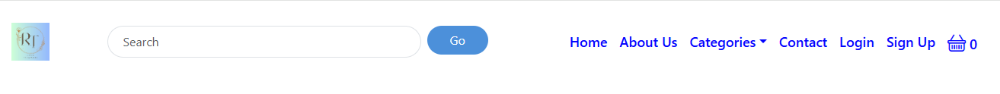

# Resin-Treasures

## User Experience

### Project Overview
Resin Treasures is a full-stack Django e-commerce platform designed to offer handmade resin presents.
It provides users with a seamless shopping experience while offering the owner complete control over product listings, orders, and customer interactions.
This program is intended to expand with new features, including loyalty incentives, wishlists, and personalised user accounts.

### Goals & Challenges
- Build a secure and user-friendly shopping platform
- Allow users to easily register, shop, and manage their profiles
- Introduce a loyalty stamp card to encourage repeat purchases
- Implement a wishlist feature for product saving
- Ensure smooth category filtering and product search

### Target Users
- Shoppers looking for unique handmade resin gifts
- Users who want to track their purchases and loyalty progress
- Customers who prefer saving items for later use with wishlists
- The shop owner who manages the inventory and orders
- Customers who prefer saving items for later use with wishlists
- The shop owner who manages the inventory and orders

## User Stories

### Authentication & User Profiles
- As a new user, I want to register for an account so I can make purchases and access my profile.
- As a returning user, I want to log in and out securely to protect my account.
- As a user, I want to view and edit my profile so I can keep my information up to date.
- As a user, I want to delete my account to remove all my data.

### Shopping & Checkout
- As a user, I want to browse products by category so I can easily find what I’m looking for.
- As a user, I want to search for products using a search bar so I can quickly find specific items.
- As a user, I want to view detailed product information before buying.
- As a user, I want to add products to my basket and update quantities.
- As a user, I want to remove items from my basket.
- As a user, I want to proceed to checkout and make a payment securely.
- As a user, I want to receive confirmation after placing an order.

### Wishlist
- As a user, I want to add items to my wishlist to save them for later.
- As a user, I want to view and manage my wishlist from my profile.
- As a user, I want to remove items I no longer want from my wishlist.

### Newsletter
- As a visitor, I want to enter my email address and subscribe to the newsletter, so that I can receive updates about new products and offers.
- As a visitor, I want to receive a confirmation email when I subscribe, so that I know my subscription was successful.
- As a visitor, I want to see a success message on the site after subscribing, so that I know my action was completed.
- As a visitor, I want to be notified if my email is already subscribed, so that I don’t accidentally subscribe multiple times.
- As a visitor, I want to be informed if my email address is invalid, so that I can correct it before submitting.
- As a subscriber, I want the ability to unsubscribe easily via a link in emails, so that I can stop receiving updates if I’m no longer interested.
- As a subscriber, I want a confirmation email or message after unsubscribing, so that I know I won’t receive further newsletters.
- As a site admin, I want to view a list of all subscribed emails, so that I can understand my audience and target communications.
- As a site admin, I want to prevent fake or temporary emails from subscribing, so that the newsletter reaches real users.
- As a site admin, I want to export subscriber emails (e.g., to CSV), so that I can use them in external marketing tools.

### Admin & Store Management
- As the site owner, I want to add, update, or delete product listings to manage my store inventory.
- As the site owner, I want to create and manage product categories to keep the store organized.
- As the site owner, I want to view and fulfill customer orders.
- As the site owner, I want to receive and respond to messages from the Contact form.

### Static Pages & Contact
- As a user, I want to visit the About page to learn about the store and its owner.
- As a user, I want to use a Contact form to ask questions or request custom orders.

## Features

### Authentication & User Accounts
- User registration and login
- Logout and delete account options
- Secure password handling
- User profile page with order history

### Shopping Experience
- Browse products by category
- Search bar for product lookup
- Detailed product pages with images and descriptions
- Add to basket and update quantities
- Full checkout process with confirmation

### Wishlist
- Add or remove items from wishlist
- View saved products in the user profile

### Newsletter
- Email subscription form
- Confirmation email when subscribed
- Duplicate and invalid email detection
- Unsubscribe link in emails
- Admin view of subscribers
- Export subscribers to CSV

### Admin Management
- Add, update, and delete products
- Manage categories and orders from the admin dashboard

### Static Pages
- About Me page to share the creator's story
- Contact Me form for customer queries

# Wireframes

Wireframes were created during the planning stage to illustrate the structure and layout of Resin Treasures' key pages. 
These low-fidelity designs helped visualise user flow, prioritise critical elements, and ensure a consistent and user-friendly experience throughout the site. 
Each wireframe depicts a key aspect of the application, such as the home page, product listing, product detail view, user profile, Wishlist, basket, checkout, and contact pages. 
The wireframes served as the foundation for creating easy navigation, clear calls-to-action, and a clean, accessible design that appealed to both new and returning customers.

### Desktop View

Login Page - Desktop

Registration Page - Desktop

Home Page - Desktop

About Page - Desktop

Category Page - Desktop

Basket Page - Desktop

Profile Page - Desktop

Checkout Page - Desktop

Payment Page - Desktop

Complete Page - Desktop

### Mobile View

Login Page - Mobile

Registration Page - Mobile

Home Page - Mobile

About Page - Mobile

Category Page - Mobile

Basket Page - Mobile

Profile Page - Mobile

Checkout Page - Mobile

Payment Page - Mobile

Complete Page - Mobile

Contact Page - Mobile

## Design & Branding  

### **Logo**

The Resin Treasures logo evokes a sense of artisanal elegance and quiet wonder. At its heart, the initials "RT" are rendered in a graceful serif font, standing tall and timeless—an emblem of refinement and craftsmanship. Encircling the monogram is a rope-like border, subtly textured to suggest both strength and softness. Delicate floral motifs bloom on either side, hinting at nature’s influence and the organic beauty of resin artistry.

The background transitions gently from a soft green to a tranquil blue, echoing the calming hues of sea glass and forest light. Beneath the initials, the brand name RESIN TREASURES appears in spaced-out, minimalist lettering—grounding the design with clarity and intention.

This logo represents a brand that values detail, respects nature, and invites its audience into a world of handcrafted serenity.

### **Colour Scheme**  

Resin Treasures uses a soft, elegant colour palette that reflects the handmade, creative, and gift-focused nature of the store. The scheme is designed to provide a calm and welcoming shopping experience while ensuring strong readability and accessibility.

Primary Colour – Classic Blue (#0000FF)
Used for navigation links and brand elements. This bold, timeless blue evokes trust and clarity, anchoring the site with a sense of reliability and digital craftsmanship.

Button Colour – Soft Sky Blue (#4C90DA)
Applied to primary call-to-action buttons like “Shop Now.” This gentle blue feels inviting and modern, guiding users with warmth and confidence.

Button Hover – Deep Indigo Blue (#3571B8)
A slightly darker shade is used on hover states to signal interactivity without overwhelming the user. It adds depth and responsiveness to the interface.

Secondary Background – Clean White (#FFFFFF)
Used across the navbar and hero sections to maintain a fresh, minimal canvas that lets resin products shine.

Neutral Text – Charcoal Grey (#333333)
Provides strong readability for body text and subtle contrast against the brighter blues, ensuring accessibility and visual balance.

#### Why This Palette?

The combination of classic blue, soft sky tones, and clean neutrals creates a user experience that’s both intuitive and emotionally safe. It mirrors the artisanal nature of resin gifts while offering a modern, trustworthy interface. Buttons feel like gentle invitations, not demands—perfect for a brand built on care, creativity, and quiet delight.

### **Typography** 

Resin Treasures uses a thoughtful pairing of two fonts — Playfair Display and Open Sans — to reflect both artisanal elegance and modern readability throughout the site.

Playfair Display. This refined serif font brings a sense of timeless craft and sophistication. With its high contrast and graceful curves, it’s perfect for headings, hero sections, and branding elements that need a poetic, handmade touch—echoing the delicate artistry of resin creations.

Open Sans: A clean, versatile sans-serif font that’s friendly and highly legible. Used for body text, navigation, and buttons, Open Sans ensures clarity across all devices while maintaining a soft, approachable tone that complements the gift-focused nature of the platform.

Together, these fonts strike a balance between elegance and ease — one expressive and craft-inspired, the other smooth and practical — enhancing the user experience with both emotional resonance and functional clarity.

### **Layout**

The page layout for *Resin Treasures* is calm, curated, and visually inviting, designed to guide users gently through the shopping experience. It features a responsive, grid-based structure with generous spacing and soft visual cues.

#### **Header Section**

- **Text:** "Handcrafted Resin Art"  
  Large, bold, and aligned to the right in the hero section.

- **Subtext:** "Free delivery on orders over £50!"  
  Smaller, friendly message placed above the main call-to-action.

#### **Hero Section**

- Full-screen background image featuring resin art and floral accents.
- A “Shop Now” button in soft blue (`#4C90DA`) with rounded corners and white text.
- Button hover effect darkens to `#3571B8` for gentle interactivity.

#### **Main Content – Product Grid**

Products are displayed in a clean, multi-column grid layout. Each item includes:

- A high-quality image of the resin piece.
- Product name and price in clear, readable fonts.
- Optional “Add to Basket” button with coral or blue accent depending on context.

This layout prioritizes emotional clarity and visual breathing room—ensuring users feel welcomed, not overwhelmed.

### **Images & Visuals**  

#### **Registration Page**

The *Resin Treasures* registration page is designed with clarity, warmth, and user trust at its core. It offers a clean, intuitive interface that welcomes new users into the brand’s sanctuary of handcrafted beauty.

#### **Header Banner**

- A sleek black banner at the top displays the message:  
  **"Free delivery on orders over £50!"**  
  This sets a friendly, value-driven tone right from the start.

#### **Form Structure**

- **Heading:** *Create Account* — centered and bold, inviting users to begin their journey.
- **Input Fields:**
  - First Name
  - Surname
  - Email (pre-filled for admin preview)
  - Password
  - Confirm Password  
  Each field is clearly labeled and spaced for ease of use.

#### **Password Guidance**

Below the password fields, a helpful checklist outlines the requirements:

- At least one uppercase letter (A–Z)  
- At least one lowercase letter (a–z)  
- At least one number (0–9)  
- At least one special character (!@#$%^&*)  
- Minimum 8 characters  

This ensures security while gently guiding users through the process.

#### **Call to Action**

- A soft blue **Register** button (`#4C90DA`) with white text and rounded corners encourages completion.
- A subtle hover effect darkens the button to `#3571B8`, signaling interactivity without pressure.
- Beneath the button, a link reads:  
  **"Already have an account? Login here"** — offering a clear path for returning users.

**Why This Matters**

The registration page isn’t just functional—it’s an invitation. With thoughtful spacing, accessible design, and emotionally safe language, it reflects *Resin Treasures’* commitment to user care and artisanal clarity.

#### **Login Page**

The *Resin Treasures* login page offers a simple, secure, and welcoming interface for returning users. Designed with clarity and ease in mind, it reflects the brand’s commitment to trust and user comfort.

#### **Form Structure**

- **Username Field**  
  Clearly labeled and placed at the top for intuitive access.

- **Password Field**  
  Includes a “Show” button to toggle visibility, supporting accessibility and user control.

- **Login Button**  
  A large, soft blue button (`#4C90DA`) with white text and rounded corners.  
  On hover, the button gently darkens to `#3571B8`, signaling interactivity without pressure.

#### **Additional Prompt**

- Below the login button, a friendly message reads:  
  **"Don't have an account? Register here"**  
  The “Register here” link is clickable, guiding new users toward account creation with ease.

#### **Visual Design**

- Background: Light blue, offering a calm and clean visual experience.
- Layout: Centered form with generous spacing, ensuring readability and emotional clarity.

**Why This Matters**

The login page isn’t just a gateway—it’s a moment of reconnection. With thoughtful design and gentle cues, it invites users back into the *Resin Treasures* experience with warmth and trust.

#### **Navagation Bar**

### Logged-out Desktop Navigation Bar

The *Resin Treasures* desktop navigation bar is designed to be clear, elegant, and emotionally intuitive—guiding users gently through the site with ease and trust.

#### **Structure & Elements**

- **Logo**  
  A circular emblem featuring the initials **RT**, positioned on the far left. It anchors the brand visually and adds a handcrafted touch.

- **Search Bar**  
  Centered beside the logo, with a placeholder text: `"Search"`  
  Accompanied by a soft blue **Go** button (`#4C90DA`) for quick access to products and content.

- **Navigation Links**  
  Aligned to the right in a clean horizontal row:
  - Home  
  - About Us  
  - Categories  
  - Contact  
  - Login  
  - Sign Up  
  Each link is styled in classic blue (`#0000FF`) with hover effects in soft indigo (`rgb(107, 126, 235)`), offering visual feedback without distraction.

- **Shopping Cart Icon**  
  Positioned next to the “Sign Up” link, signaling e-commerce functionality and easy access to the user’s basket.

#### **Design Principles**

- **Layout**: Responsive and evenly spaced, ensuring clarity across screen sizes.
- **Color**: Blue accents convey trust and consistency, while a white background maintains a clean, breathable aesthetic.
- **Typography**: Medium-weight sans-serif fonts (`font-weight: 500; font-size: 18px`) for readability and emotional warmth.

The navigation bar isn’t just a menu—it’s a moment of orientation. It reflects *Resin Treasures’* commitment to user comfort, clarity, and handcrafted elegance from the very first click.

### 🖥️ Logged-In Desktop Navigation Bar

The *Resin Treasures* desktop navigation for logged-in users is designed to feel personal, polished, and emotionally intuitive—offering returning customers a seamless way to explore, manage, and shop with confidence.

#### **Structure & Elements**

- **Logo**  
  A circular emblem featuring the initials **KM**, set against a soft gradient of light blue and green. It anchors the brand with a sense of calm and artisanal identity.

- **Search Bar**  
  Positioned beside the logo with the placeholder `"Search"` and a soft blue **Go** button (`#4C90DA`). It invites users to explore with ease and intention.

- **Navigation Links**  
  Aligned to the right in a clean horizontal row, styled in classic blue (`#0000FF`):
  - Home  
  - About Us  
  - Categories ⌄ *(dropdown menu for product types)*  
  - Contact  
  - My Account ⌄ *(dropdown menu for profile, orders, settings)*  

  Each link is spaced for clarity and includes hover effects in soft indigo (`rgb(107, 126, 235)`), offering gentle feedback without visual noise.

- **Shopping Cart Icon**  
  Positioned at the far right, showing the current item count. It provides quick access to the user’s basket while maintaining visual harmony.

#### **Design Principles**

- **Color Palette:** Blue accents convey trust and consistency, while the gradient background adds a touch of serenity and craft.
- **Typography:** Medium-weight sans-serif fonts (`font-weight: 500; font-size: 18px`) for readability and emotional warmth.
- **Layout:** Responsive and evenly spaced, ensuring clarity across screen sizes and devices.

The logged-in desktop navigation reflects *Resin Treasures’* commitment to user care, personalization, and handcrafted elegance. It’s not just a menu—it’s a moment of orientation, connection, and quiet delight.

### Logged-Out Mobile Navigation

The *Resin Treasures* mobile navigation is designed to be intuitive, elegant, and emotionally attuned—offering users a calm entry point into the site, even on smaller screens.

#### **Top Section**

- **Logo:**  
  A circular emblem featuring the initials **RT** with the word *LIFESTYLE* beneath, framed by a decorative rope and floral motif. It anchors the brand with artisanal charm and visual identity.

- **Hamburger Menu Icon:**  
  Positioned to the right of the logo, the three-line icon opens the vertical navigation menu. It’s minimal and familiar, ensuring ease of use across devices.

#### **Navigation Menu (Expanded)**

Displayed vertically in soft blue text (`#0000FF`) for clarity and consistency:

- Home  
- About Us  
- Categories ⌄ *(dropdown indicator)*  
- Contact  
- Login  
- Sign Up  

Each link is spaced for touch-friendly interaction and emotional clarity.

#### **Cart Preview**

- A shopping cart icon appears at the bottom of the menu.
- Displays item count (e.g., `0`) to gently inform users of their basket status.

#### **Design Notes**

- **Color Palette:** Light blue background with blue text for a clean, breathable feel.
- **Typography:** Medium-weight sans-serif for readability and warmth.
- **Spacing:** Generous padding ensures no element feels cramped or overwhelming.

The mobile navigation reflects *Resin Treasures’* commitment to accessibility, emotional ease, and handcrafted elegance. Even in compact form, it invites users into a space of clarity, care, and creative exploration.

### Logged-In Mobile Navigation

The *Resin Treasures* mobile navigation for logged-in users is designed to feel personal, intuitive, and emotionally safe—offering returning customers a seamless way to explore, manage, and shop with ease.

#### **Top Section**

- **Logo:**  
  A circular emblem featuring the initials **RJ** with the word *LUXEARE* beneath, framed by a decorative rope and floral motif. It reinforces brand identity with a handcrafted, lifestyle-inspired aesthetic.

- **Hamburger Menu Icon:**  
  Positioned to the right of the logo, the familiar three-line icon opens the vertical navigation menu. It’s touch-friendly and visually unobtrusive.

#### **Navigation Menu (Expanded)**

Displayed vertically in classic blue text (`#0000FF`) for consistency and clarity:

- Home  
- About Us  
- Categories ⌄ *(dropdown indicator)*  
- Contact  
- My Account ⌄ *(dropdown indicator for profile, orders, settings)*  

Each item is spaced for easy tapping and emotional clarity, with dropdowns offering deeper access to personalized features.

#### **Cart Preview**

- A shopping cart icon appears at the bottom of the menu.
- Displays item count (e.g., `0`) to gently inform users of their basket status.

#### **Design Notes**

- **Color Palette:** Light blue background with blue text for a clean, breathable feel.
- **Typography:** Medium-weight sans-serif for readability and warmth.
- **Spacing:** Generous padding ensures no element feels cramped or overwhelming.

The logged-in mobile navigation reflects *Resin Treasures’* commitment to user care, personalization, and emotional clarity. It’s not just functional—it’s a quiet invitation to continue exploring, creating, and connecting.

#### **Home Page**

The Welcome Page of The Crochet Files invites users into a cozy, colorful space to explore different crochet project categories. The layout features a friendly greeting at the top, followed by a prompt to select a category.

Displayed in a 2-row, 3-column grid, each category is represented with:

A vibrant, high-quality photo of a crocheted item

A label beneath each image's name indicates the category

Categories include:

- Blankets – Warm, textured throws for cozy vibes

- Cardigans – Stylish, handmade wearables

- Amigurumi – Adorable stuffed animals and characters

- Scarves – Colorful, snug accessories

- Hats – Beanies and pom-pom-topped headwear

- Dishcloths – Functional and decorative essentials

The entire layout sits on a soft blue background, reflecting the calm and creative spirit of the crochet community. Each card is spaced evenly and bordered in white, making navigation both intuitive and visually inviting.

#### **Add Pattern Page**

The “Add a New Pattern” page on The Crochet Files allows users to share their crochet creations by submitting detailed pattern entries. The page features a clean form layout with labeled fields for user input.

##### Form Fields Include:

Pattern Name – A single-line text field to title the pattern.

Description – A larger text area for an overview or story behind the pattern.

Skill Level – A dropdown menu to select difficulty (e.g., Beginner).

Materials Needed – A field to list yarn types, hook sizes, and other supplies.

Category – Dropdown to categorize the pattern (e.g., Blanket, Hat, Amigurumi).

Notes – Optional space for tips, modifications, or personal thoughts.

##### File Uploads:

Upload Pattern (PDF) – Attach a pattern file to share with others.

Upload Image – Upload a photo of the finished project for inspiration.

At the bottom, a rounded “Save Project” button allows users to submit their pattern once complete.

The page uses a soft blue background with a simple, welcoming aesthetic, keeping the focus on creativity and contribution.

#### **Pattern Page**

The Crochet Files page is a beautifully laid-out collection of user-added crochet patterns. It serves as a gallery where each pattern is presented with a preview, allowing users to browse, view, edit, or delete their creations.

##### Page Layout & Features:

##### Add New Pattern Button:

Located at the top, this button allows users to quickly navigate to the form for submitting a new crochet pattern.

##### Pattern Cards:

Each pattern is displayed within an individual, color-bordered card.

Image Preview: A photo representing the crochet project.

Pattern Title: Clearly stated at the top of the card.

Short Description: A summary of the pattern’s charm and purpose (truncated for quick browsing).

Skill Level: Shows the required experience: Beginner, Intermediate, and Advanced.

Category: Organizes the pattern type: Blankets, Cardigans, Amigurumi, Hats, Scarves, and Dishcloths.

##### Action Buttons:

View Pattern: Takes the user to the full pattern description and downloadable resources.

Edit: Allows the user to update any pattern details.

Delete: Removes the pattern from the list.

Design: Uses soft pastel colors and a dotted border for each card to give a handcrafted, friendly vibe.

Clear layout promotes easy navigation and interaction with each pattern.

#### **View/Download Button** 

The View/Download Button is an essential feature on the site, enabling users to either view or download crochet patterns. This button opens the pattern in a new window, ensuring the user experience remains smooth and uninterrupted while browsing the site.

##### Features:

Text: The button is clearly labeled with either "View Pattern" or "Download Pattern", depending on the action it performs.

##### Action:

View Pattern: When users click this option, the pattern opens in a new window or tab. This allows users to view the full pattern without navigating away from the current page, keeping them engaged with the website.

Download Pattern: Clicking this option opens the pattern file for download, typically in PDF format, so users can save it to their devices for offline use.

##### Design:

The button is styled with a soft blue background and black text, ensuring it blends seamlessly with the overall pastel color palette of the site.

Rounded corners create a friendly, approachable look, fitting the overall aesthetic of the site.

A hover effect is applied to the button, darkening the background color slightly to indicate interactivity and enhance the visual appeal.

Placement: Positioned below the pattern’s description or image, the button is easily visible and accessible for users looking to view or download the pattern.

Responsive: The button is fully responsive, ensuring that it functions correctly across all devices (desktop, tablet, and mobile). On mobile, the button remains large enough to be easily clicked or tapped.

##### Design Highlights:

Consistent pastel color scheme that complements the rest of the site.

Clear, intuitive functionality that allows users to either view or download patterns without leaving the current page or tab.

Smooth hover transition effect for added interactivity and visual feedback.

#### **Download View** 

When the user clicks on the View/Download Pattern button, the action is designed to open the crochet pattern in a new browser window or tab, allowing users to view the full pattern without leaving the current page they’re on.

The user can click on the download arrow so they can save it to there device. 

#### **View, Edit and Delete Buttons**

#### View Button

Purpose: The View button allows users to open the full details of a crochet pattern.

How it Works: When clicked, it takes the user to a dedicated page where they can see the full pattern information — including materials, skill level, notes, images, and download links.

Design: It’s usually styled with a soft blue outline to match the site’s pastel theme.

User Experience: Users can explore the complete pattern without accidentally editing or deleting anything, making it safe for viewing only.

#### Edit Button

Purpose: The Edit button allows users to update or correct details of a pattern they have created.

How it Works: When clicked, it navigates the user to an editable form pre-filled with the pattern’s current information. The user can change text, replace images, or upload a new file.

Design: Often styled slightly differently (such as using a pencil icon or a colored border) to visually indicate its function.

User Experience: Users can quickly make adjustments — like fixing a typo, updating materials, or adding extra notes — without needing to recreate the whole pattern.

#### Delete Button

Purpose: The Delete button allows users to permanently remove a pattern they have posted.

How it Works:

When clicked, a confirmation prompt usually appears asking the user if they are sure they want to delete the pattern (to prevent accidents).

Once confirmed, the pattern is removed from the database and no longer appears on the site.

Design: Typically styled in a color that signals caution (like a soft red or orange outline) to make users aware that it's a destructive action.

User Experience: The deletion process is designed to be quick but careful, ensuring users don’t lose content by mistake.

#### Project Detail Page Description (View Project Page)

This page displays the full details of a single crochet project, combining both visual and textual elements in a clean, user-friendly layout that matches the site's soft, pastel design.

##### Page Layout:
Background: Light pastel blue, maintaining the calming, cohesive theme across the site.

Card Design: A large white rounded card with subtle shadows, keeping the focus on the project content.

##### Content Sections:
##### Project Image:

Positioned on the left side of the card.

Large and clear, showing a detailed view of the crochet project (in this case, two adorable penguin plushies).

Helps users immediately see what the project looks like, inspiring interest and creativity.

##### Project Information (on the right side):

Project Title: Displayed prominently at the top in bold, large text (e.g., "Penguin").

Category: A smaller label showing the type of project (e.g., "Amigurumi").

Description: A friendly, inviting paragraph that introduces the project, its features, and suggestions for use. It sets a warm, helpful tone.

Skill Level: Listed to help users quickly understand the difficulty (e.g., "Intermediate").

Materials Needed: A practical list of supplies like yarn type, hook size, and accessories needed to complete the project.

##### Action Buttons:
##### View/Download Pattern Button:

Located under the materials list.

Styled with a soft blue outline and rounded edges to stay on-brand.

When clicked, the pattern opens in a new browser tab or window, allowing users to view or download the pattern without losing their place on the site.

##### Like Button:

Soft pink button beneath the download button.

Allows users to like the project, with a visible counter showing how many likes it has received (e.g., "2 Likes").

##### Navigation:
##### Navbar at the top includes:

Home | Add Pattern | Patterns | Logout

It provides users with easy access to different parts of the site while keeping them logged in and engaged.

##### Overall Feel:
This page is bright, organized, and welcoming, making it easy for users to enjoy viewing crochet projects, quickly find important project information, and interact with patterns through likes and downloads.

#### **Comment Section**

The Comment Section allows users to engage with crochet patterns by sharing their thoughts, feedback, and experiences. It fosters a sense of community where users can ask questions, offer tips, or simply express appreciation for a pattern. This section is placed beneath the pattern’s description or image, encouraging interaction among users.

##### Features:

Text Input Area: Users can type and submit their comments about the crochet pattern. The input field is designed to be simple and easy to use, encouraging participation from both beginners and experienced crocheters.

Submit Button: Once the user has typed their comment, they can click the Submit button to post it. The button is typically styled with a soft color to match the site's pastel theme.

##### Comment Display:

Each comment is displayed underneath the input field, in a clear, organized layout.

User Information: The user’s name or username is displayed next to their comment to identify the poster.

Timestamp: Each comment is accompanied by a timestamp indicating when it was posted, adding context to the conversation.

Reply Feature: Users can respond to other comments, allowing for threaded discussions. This makes it easier for users to engage in specific conversations about the pattern, technique, or tips shared.

Delete/Modify Option: Users can edit or delete their own comments if needed, ensuring control over their input. (Optional feature)

##### Design Highlights:

The comment section is designed with a clean, minimalist layout that integrates seamlessly with the rest of the site’s aesthetic.

Soft pastel color scheme: The background and borders of the comment section are in soft pastel tones, keeping the atmosphere light and welcoming.

Easy Navigation: The comment input area and buttons are designed to be simple and intuitive, encouraging users to contribute without confusion.

Mobile Responsive: The comment section adjusts for smaller screens, ensuring users can easily comment from mobile devices.

##### User Experience:

Engagement: This section creates a space for users to engage with the pattern, ask questions, share modifications, or simply express gratitude.

Community Building: By allowing users to interact with each other, the comment section helps build a sense of community, with people learning from one another and sharing their experiences.

##### **Comment Section With a Comment**

#### **Blanket Pattern Page** 

This page is a "Blanket Patterns" section from a crochet-themed website, likely part of The Crochet Files or My Crochet Page. It displays six crochet blanket pattern cards in a visually appealing grid layout, using a soft, pastel color palette with a light blue background. Each card includes:

Pattern Name: Bunny Blanket, Baby Blanket, and more.

Image of the blanket

Brief Description of the pattern

A "View Pattern" button styled with a blue border and hover effect

The six featured blanket patterns are:

Bunny Blanket – A cozy blanket with an adorable bunny theme.

Baby Blanket – A simple, soothing baby blanket ideal for beginners.

Granny Square Blanket – A vibrant, colorful take on a traditional granny square design.

Lattice Blanket – Elegant with a textured design, great for home decor.

Shell Blanket – Features pastel shell stitch patterns, soft and elegant.

Cat and Mouse Blanket – Whimsical and fun, featuring cat and mouse motifs.

Each pattern is likely clickable for more details. The layout and card style are consistent and user-friendly, making it easy to browse.

#### **Cardigan Pattern Page**

This page is the "Cardigan Patterns" section of your crochet-themed website. It follows the same clean, pastel-toned design as the “Blanket Patterns” page, with a light blue background, rounded white cards, and consistent card layout.

Each card includes:

A project image

Pattern title in bold

A brief description of the pattern

A blue-bordered "View Pattern" button

The featured cardigan patterns are:

Adult Crew Neck Sweater – A timeless and versatile casual sweater.

Matinee Jacket – A warm and elegant jacket, ideal for babies or special occasions.

Gathering Leaves Cardigan – A charming, fall-themed cardigan with swirling leaf motifs.

Iris Cardigan – A long, elegant cardigan perfect for layering, featuring a classic design.

Peggy Cardigan – A red cardigan with a relaxed fit, adding subtle elegance to casual outfits.

Baby Cardigan – A soft and stylish option for babies, with matching booties in the image.

##### Design Notes:

The cards have consistent sizing and styling.

The descriptions are concise and inviting.

Button design matches the “Blanket Patterns” section, ensuring visual harmony.

#### **Amigurumi Pattern Page**

This is the "Amigurumi Patterns" section of your crochet website, showcasing cute and creative crocheted characters and toys. It follows the same consistent and visually cohesive design as the other pattern sections, with a pastel blue background and clean white pattern cards.

##### Each card includes:

An image of the amigurumi character

A pattern title

A short description

A "View Pattern" button with a blue outline

The featured Amigurumi patterns:

Barnyard Friends Collection – A group of adorable farm animals including a pig, chick, and lamb.

Bumble Bee Keyring – Small, cheerful bee keychains to brighten your day.

Octopus – A soft, stackable octopus plushie with wiggly legs and friendly faces.

Penguin – A cute, chubby penguin plushie with flipper wings and a tiny beak.

Pikachu – A crocheted version of the beloved Pokémon character, full of energy and fun.

Disney Stitch – A playful Stitch plushie, full of mischief and charm.

##### Design Highlights:

The layout is neatly arranged in two rows of three cards.

The images are vibrant and engaging, perfect for grabbing attention.

The tone is whimsical and lighthearted, matching the amigurumi theme well.

#### **Scarf Pattern Page**

This is the "Scarves Patterns" section of your crochet website, dedicated to stylish and cozy accessories perfect for any season. It keeps the same cohesive design as the rest of the site, featuring a soft pastel blue background and crisp white pattern cards.

##### Each card includes:

An image of the scarf

A pattern title

A short, catchy description

A "View Pattern" button with a soft blue outline

##### The featured Scarf patterns:

Bow Scarf – A chic scarf with a playful bow detail, blending style and whimsy.

Infinity Scarf – An endlessly looped scarf for effortless layering and warmth.

Mouse Snoody – A cute, critter-themed snoody with cozy character and charm.

Racer Wrap – A bold, modern wrap with clean lines and sleek design.

Straight Up Scarf – A minimal and timeless scarf that pairs with anything.

Zepplin Scarf – Airy and modern, this scarf adds elevated simplicity to your look.

##### Design Highlights:

Patterns are displayed in a clean two-row, three-column grid for easy browsing.

Each image showcases the scarf clearly, inviting users to explore further.

The tone is cozy, stylish, and inviting — just like the scarves themselves.

#### **Hat Pattern Page**

This is the "Hats Patterns" section of your crochet website, showcasing cozy and creative headwear for all styles and seasons. The design remains consistent with the rest of the site — a soft pastel blue background with clean, white pattern cards that make each item pop.

##### Each card includes:

An image of the crochet hat

A pattern title

A short, engaging description

A "View Pattern" button outlined in soft blue

##### The featured Hat patterns:

Cinnamon Swirl Hat and Scarf Set – A warm, coordinating set inspired by cozy cinnamon tones and classic style.

Beginner Beanie – A simple and approachable pattern, perfect for first-time crocheters or relaxing weekend projects.

Candy Cap – Bright, sweet, and full of fun — this playful hat brings a splash of color to any outfit.

Elegant Hat – A refined accessory with timeless charm, perfect for dressing up or down.

Fox Hat – A woodland-inspired design featuring fox ears and adorable detailing for a whimsical touch.

Pebbled Hat – A textured beanie with a stylish “pebbled” surface, offering both warmth and visual interest.

##### Design Highlights:

Patterns are arranged neatly in a two-row, three-column grid for easy browsing.

Each hat is presented with a vibrant image to capture its unique flair.

The tone is playful, stylish, and cozy, matching the warm and creative vibe of the hat category.

#### **Dishcloth Pattern Page**

This is the "Dishcloth Patterns" section of your crochet website, featuring a collection of functional and decorative crochet patterns for the kitchen and home. Staying true to the site’s aesthetic, the section is presented with a soft pastel blue background and clean white pattern cards for a cohesive, inviting look.

##### Each card includes:

An image of the dishcloth or coaster

A pattern title

A short, friendly description

A "View Pattern" button outlined in blue

##### The featured Dishcloth patterns:

Dishcloth and Tea Towel – A simple and elegant set that blends style and function for your daily kitchen needs.

Corgi Butts Coasters – Playful and adorable, these coasters bring a smile with every fluffy-tailed corgi design.

Fantasy Naturale – A bright and practical dishcloth that highlights natural cotton yarn in bold, fun colors.

Holi Inspired Dishcloth – A festive and colorful design inspired by the joyful hues of the Holi celebration.

Sunburst Coaster – Radiating texture and cheer, this sunny coaster adds handmade warmth to any table.

Snowflake Coaster – Delicate and elegant, this winter-themed design adds a touch of seasonal magic to your décor.

##### Design Highlights:

All pattern cards are arranged in a neat two-row, three-column grid.

Images are bright and showcase the texture and shape of each dishcloth.

The tone is cheerful and homey, matching the comforting, everyday nature of dishcloths and coasters.

#### **Edit Project Page**

This is the "Edit Pattern" section of your crochet website, where you can easily update or refine the details of your crochet patterns. The page has been designed to ensure a smooth and intuitive editing process, all while keeping in line with the clean, inviting aesthetic of the site.

##### Each section includes:

Pattern Title: Edit the name of your crochet creation.

Category: Choose the most fitting category for your pattern, such as Blankets, Scarves, or Dishcloths.

Description: Add or update a friendly, short description that highlights the details of your pattern.

Skill Level: Adjust the difficulty level to guide crocheters of all abilities.

Materials Needed: List the yarns, hooks, and any additional supplies required.

Notes: Include any important tips or special instructions for makers.

Pattern File: Attach or change the pattern if available for download or printing.

Image: Update or upload an image that showcases your pattern.

##### Design Highlights:

The page is clean and minimalist, with fields clearly outlined for easy editing.

All updates are immediately visible, with an option to preview changes before finalizing.

The soft pastel theme creates a welcoming, user-friendly interface that aligns with the overall aesthetic of the site.

Once you’ve made your changes, don’t forget to save and share your updated creation with the crochet community!

#### **Logout**

The Logout button is located in the top-right corner of the navigation bar.
When clicked, it securely logs the user out of their account and redirects them back to the Home page.
This ensures users leave their session safely while returning to a welcoming, public view of the site.

The button is styled to match the site's design, with a soft, rounded appearance and subtle hover effect.

### **Accessibility**  

Accessibility has been a key focus during the development of The Crochet Files, ensuring that all users, including those with disabilities, can comfortably navigate and enjoy the website. Several strategies were implemented to create an inclusive experience:

Text Contrast

High Contrast: The site follows the Web Content Accessibility Guidelines (WCAG) by maintaining strong contrast between text and background elements, making content easier to read for users with visual impairments such as low vision or color blindness.

Color Scheme: A soft pastel palette is used thoughtfully, with careful attention to contrast ratios. This ensures that all text remains legible and content stands out clearly against background colors.

Alt Text for Images

Descriptive Alt Text: All images across the website — including project images and category sections — feature meaningful alternative (alt) text. This provides helpful descriptions for users who rely on screen readers or have images disabled.

Contextual Relevance: Alt text is kept concise yet descriptive, helping users understand the purpose and content of each image without visual input.

Keyboard Navigation Support

Keyboard Accessibility: The site is fully navigable using a keyboard alone. Users can move through links, buttons, and form fields using the Tab key, and activate them using the Enter key.

Focus Indicators: Clear visual focus indicators (such as outline borders) are provided to show which element is currently selected, helping users who navigate without a mouse.

Accessible Forms: All forms — including login, registration, project submission, and editing forms — are properly labeled and structured to be easily usable with a keyboard.

By implementing these features, The Crochet Files aims to provide a welcoming and accessible experience for all users, regardless of ability.

## 🗄️ Database & Backend

### 🧩 Data Structure & Relationships

#### 📐 Database Design Process

The database for **Crochet Files** was carefully structured to be efficient, scalable, and user-friendly. The design process followed three key phases:

1. **Requirements Analysis** – Understanding the needs of the platform
2. **Data Structuring** – Defining tables and their relationships
3. **Normalisation** – Eliminating redundancy and enforcing integrity

---

#### 📋 Requirements Analysis

The database was designed to support the following core functionalities:

- Users can share crochet projects.
- Users can like and comment on projects.
- Projects are organized by category and difficulty.
- Only registered users can upload, comment, and like projects.

---

#### 🧱 Data Tables & Core Entities

Each major feature is represented by a dedicated table:

| Entity         | Purpose                                               |
|----------------|--------------------------------------------------------|
| **User**       | Stores user credentials and authentication info       |
| **Project**    | Stores crochet project details                        |
| **Category**   | Organizes projects into types like scarves, hats, etc.|
| **Comment**    | Allows users to comment on projects                   |
| **Like**       | Tracks which users have liked which projects          |

---

#### 🔁 Relationships Between Tables

- **One-to-Many**:
  - A **User** can create many **Projects**
  - A **Category** can include many **Projects**

- **Many-to-Many**:
  - A **User** can like many **Projects**, and a **Project** can be liked by many users (via the **Like** table)

---

#### 📊 Entity Relationship Diagram (ERD)

The ERD below visualises how the main entities relate:

ERD

 

---

#### 🧹 Normalisation for Integrity

The database is normalised up to the **Third Normal Form (3NF)**:

- **1NF**: Each field contains atomic values
- **2NF**: All non-key attributes fully depend on the primary key
- **3NF**: No transitive dependencies between non-key attributes

Example: Category names are stored once in the Category table and referenced using foreign keys across related tables.

---

### 🏗️ Backend Architecture

#### 🛠️ Technologies Used

| Tool         | Purpose                                   |
|--------------|--------------------------------------------|
| **Django**   | Backend framework with ORM and admin panel |
| **PostgreSQL** | Relational database                      |
| **Cloudinary** | Media storage for images and files        |
| **Heroku**   | Hosting and deployment                     |
| **Gunicorn** | WSGI server for Heroku                     |

---

#### 📦 Key Models

| Model        | Description                                             |
|--------------|---------------------------------------------------------|
| **User**     | Django's built-in auth system                           |
| **Project**  | Contains project info (title, images, category, etc.)   |
| **Category** | Categories like "Blanket", "Hat", "Scarf"               |
| **Comment**  | Stores user comments on projects                        |
| **Like**     | Tracks likes from users on projects                     |

---

#### 🧩 Model Field Types

- `CharField` – Titles and names
- `TextField` – Descriptions, notes, comments
- `ImageField` / `CloudinaryField` – For media upload
- `ForeignKey` – One-to-many relationships (e.g., user to projects)
- `ManyToManyField` – Many-to-many via Like model

---

### 🔀 Views & URLs

- **CRUD Operations**:
  - Users can create, read, update, and delete Projects, Comments, and Likes.
- **URL Patterns**:
  - `/files/` – List all crochet projects
  - `/files/category/<slug>/` – Filter by category

---

### 🔐 User Authentication & Permissions

- Utilises Django's built-in **User Authentication**
- **Permissions**:
  - Only registered users can post, comment, and like
  - Anonymous users can browse only

---

### 🔒 Security Measures

- **Passwords**: Securely hashed via Django
- **HTTPS**: Enforced by Heroku settings
- **Cloudinary**: Authenticated and secure media uploads
- **Input Validation**: Django handles protection against SQL injection, CSRF, and XSS

---

### 🚀 Deployment

The backend is deployed on **Heroku** with the following configuration:

- **Database**: PostgreSQL (via Heroku add-on)
- **Media Hosting**: Cloudinary for static and uploaded files
- **Environment Variables**: Managed securely via Heroku Config Vars
- **Scalability**: Ready to scale with additional dynos and optimised queries

📝 _For detailed deployment steps, refer to the `DEPLOYMENT.md` file._

---

### 📈 Logging & Monitoring

- **Planned Tooling**: Integration with Sentry for real-time error tracking

---

### 🧱 Languages & Technologies

- HTML5  
- CSS3  
- Python  
- Django  
- Heroku  
- PostgreSQL  

---

### 🧰 Frameworks, Libraries & Programs

- **Bootstrap 5** – For responsive layout and styling  
- **Hover.css** – Applied to social icons for smooth hover effects  
- **Google Fonts** – 'Quicksand' font used site-wide for clean typography  
- **Font Awesome** – Icon library for consistent UI enhancement  
- **jQuery** – Included with Bootstrap for responsive navbar and scroll effects  
- **Git** – Version control, commits made in Gitpod and pushed to GitHub  
- **GitHub** – Repository hosting for versioned project source code  
- **Heroku** – Cloud platform used for live deployment  
- **Balsamiq** – Low-fidelity wireframing tool for UI layout planning  
- **Lucidchart** – Used for diagrams, flowcharts, and visual planning  

## Future Features

To further improve **Crochet Files**, the following features are planned:

- **👤 User Profiles:** Personalized pages showing each user's uploaded files, likes, and comments.
- **🔒 Password Recovery:** "Forgot Password" functionality with secure email reset.
- **🔍 Search & Filters:** Quick search and advanced filtering by category, title, or difficulty.
- **⭐ Favorites:** Option to save favorite crochet files for easy access later.
- **🔔 Notifications:** Alerts for likes, comments, and new uploads from followed users.
- **🛠️ Admin Tools:** Backend dashboard for managing users, projects, and content.
- **📤 Social Sharing:** Easy sharing of crochet files to platforms like Pinterest and Instagram.

These enhancements aim to make Crochet Files a more interactive, user-friendly, and inspiring community for crochet enthusiasts.

### Project Status

Crochet Files is fully functional and has core features in place.  
Future updates will focus on enhancing user experience, adding social and profile features, and scaling for growth.

## Credits

### Code

[Bootstrap5](https://getbootstrap.com/docs/5.3.3/getting-started/introduction/): Bootstrap Library used throughout the project mainly to make the site responsive using the Bootstrap Grid System.

### Content

The developer wrote all the content.

The learn more page information was created by [chatgpt.com](https://chatgpt.com/)

### Media

All Images were created by the [fontawesome](https://fontawesome.com/)

### 👤Reviews 

**Lindsey** - The layout of the Crochet Files Project site is beautiful and easy to navigate. 
The minimalist design lets the patterns shine, and everything is neatly organized into categories. 
I found what I needed in seconds!

**Sarah M** - From the homepage to the downloads section, everything is thoughtfully laid out. 
The structure makes it easy to follow a crochet journey, and I loved the featured project highlights on the front page

**Gemma** - Great patterns and very well-organized files. Loved the aesthetic and how easy everything was to download and follow

**Netti** - The site is well-organized and easy to navigate, and I’ve enjoyed exploring the patterns. 
That said, I think it would be even better with a user profile option—somewhere to save favorites, track progress, or keep notes. 
It’s a small thing, but it would make the experience feel more personal

**Sarah R** - The visual layout is creative without being overwhelming. 
I especially liked the little visual previews of each pattern—made browsing super enjoyable. 
A lot of care went into the design.

### Acknowledgements

All images and patterns were from [Love Crafts] (https://www.lovecrafts.com/)
Barnyard Friends Collection, Snuggle Bunny, Cinnamon Swirl Hat and Scarf Set  By Paintbox Yarns
Diamond Lattice Blanket By Bernat
Amigurumi Stitch By Shannen Nicole C
Pastel Shells Baby Blanket By Vivienne (peach.unicorn) 
Adult's Crochet Crew Neck Cardigan, Cat & Mouse, Pebbled Texture Crochet Hat By Caron 
Bumble Bee keyring by Catharina U 
Beginner Beanie By Caron 
Peggy Cardigan By Wool and the Gang
Pikachu By Olka Novytska
Granny Square Blanket By Annemarie Benthem 
Iris Cardigan By Adriafil

My Mentor for continuous helpful feedback.

Tutor support at Code Institute for their support.

Family and Friends for feedback.

