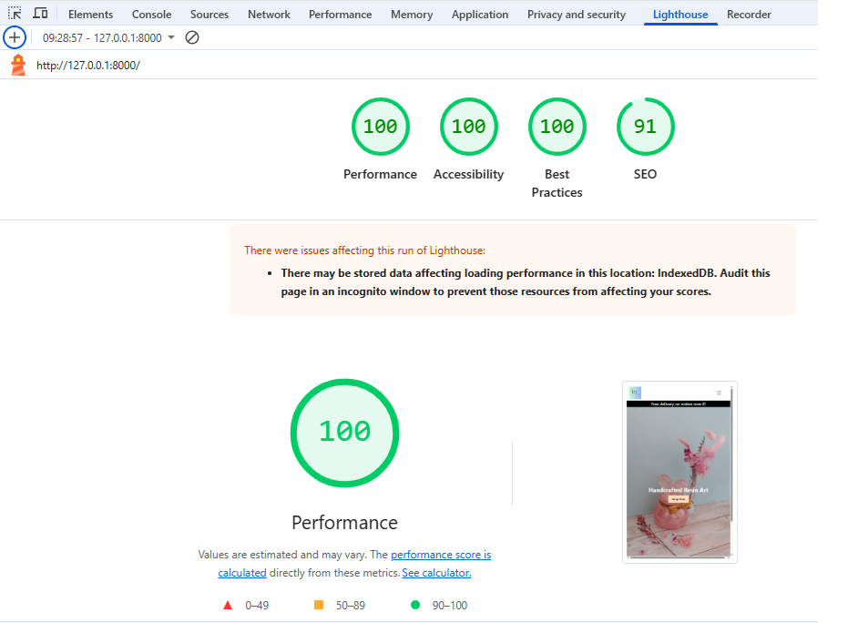
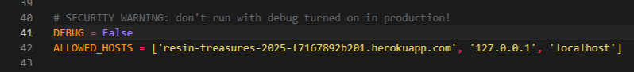

# Resin-Treasures

[View the live project here.](https://resin-treasures-2025-f7167892b201.herokuapp.com/)

## Testing

### Testing User Stories 

### Authentication & User Profiles
- As a new user, I want to register for an account so I can make purchases and access my profile.

- As a returning user, I want to log in and out securely to protect my account.

- As a user, I want to view and edit my profile so I can keep my information up to date.

- As a user, I want to delete my account to remove all my data.

### Shopping & Checkout
- As a user, I want to browse products by category so I can easily find what I’m looking for.

- As a user, I want to search for products using a search bar so I can quickly find specific items.

- As a user, I want to view detailed product information before buying.

- As a user, I want to add products to my basket and update quantities.
- As a user, I want to remove items from my basket.

- As a user, I want to proceed to checkout and make a payment securely.

 

- As a user, I want to receive confirmation after placing an order.

### Wishlist
- As a user, I want to add items to my wishlist to save them for later.

 

 

- As a user, I want to view and manage my wishlist from my profile.
- As a user, I want to remove items I no longer want from my wishlist.

 

### Newsletter

- As a visitor, I want to enter my email address and subscribe to the newsletter, so that I can receive updates about new products and offers.

 

- As a visitor, I want to receive a confirmation email when I subscribe, so that I know my subscription was successful.

 

- As a visitor, I want to see a success message on the site after subscribing, so that I know my action was completed.

 

- As a visitor, I want to be notified if my email is already subscribed, so that I don’t accidentally subscribe multiple times.

  

- As a site admin, I want to view a list of all subscribed emails, so that I can understand my audience and target communications.

 

 

### Admin & Store Management
- As the site owner, I want to add, update, or delete product listings to manage my store inventory.

 

- As the site owner, I want to create and manage product categories to keep the store organized.

 
 
- As the site owner, I want to view and fulfill customer orders.

 
 
### Static Pages & Contact

- As a user, I want to visit the About page to learn about the store and its owner.

 

- As a user, I want to use a Contact form to ask questions or request custom orders.

 

## 🚀 Lighthouse Performance Report

The site was tested using Chrome's Lighthouse tool to measure key performance metrics, including accessibility, best practices, and SEO.

Login Page 

Registration Page 

Home Page 

About Page 

Category Page 

Basket Page 

Wishlist Page 

Profile Page 

Checkout Page 

Complete Page 

Review Page 

### 🖥️ Desktop View

✅ The layout scales correctly  
✅ Navigation works as expected  
✅ All buttons and forms are accessible  

#### Login Page 

#### Registration Page

#### Home Page

#### About Page 

#### Category Page 

#### Basket Page 

#### Wishlist Page 

#### Profile Page

#### Payment Page 

#### Checkout Page 

#### Complete Page 

#### Review Page 

#### Contact Page 

---

### 📱 Mobile View

✅ Navigation collapses correctly  
✅ Forms are readable and scrollable  
✅ Cards and buttons scale appropriately  

#### 📸 Screenshots

#### Login Page 

#### Registration Page

#### Home Page

#### About Page 

#### Category Page 

#### Basket Page 

#### Wishlist Page 

#### Profile Page

#### Payment Page 

#### Checkout Page 

#### Complete Page 

#### Review Page 

#### Contact Page 

## Manual Test Cases

The following features were manually tested across desktop and mobile devices to ensure a smooth, emotionally safe experience for all users.

| Feature                             | Test Case Description                                              | Status   |
|-------------------------------------|--------------------------------------------------------------------|----------|
| 🔐 User Registration                | Sign up with valid and invalid credentials                         | ✅ Pass   |
| 🔓 User Login/Logout                | Login/logout flow works as expected                                | ✅ Pass   |
| 👤 User Profile                     | Profile page displays user info and order history                  | ✅ Pass   |
| 🛒 Add to Basket                    | Correct product is added to basket                                 | ✅ Pass   |
| ➕ Update Basket Quantity           | Quantity can be increased/decreased, totals update                 | ✅ Pass   |
| ❌ Remove from Basket               | Item removed and basket updates correctly                          | ✅ Pass   |
| 💳 Checkout & Payment               | Checkout form validates, order is processed successfully           | ✅ Pass   |
| 📦 Order Confirmation               | Confirmation page displays order details and thank-you message     | ✅ Pass   |
| 💬 Comment on Post                  | Comments can be added and displayed under posts                    | ✅ Pass   |
| 📱 Mobile Responsiveness            | Pages adapt correctly to smaller screen sizes                      | ✅ Pass   |
| 🧭 Navbar Functionality             | All links and dropdowns navigate correctly                         | ✅ Pass   |
| 🖼️ Image Uploads (Cloudinary)       | Images upload and display as expected                              | ✅ Pass   |
| 💖 Add to Wishlist                  | Product added to wishlist via heart icon                           | ✅ Pass   |
| 📂 View & Manage Wishlist           | Wishlist page displays saved items with remove/view options        | ✅ Pass   |
| ❌ Remove from Wishlist             | Item removed from wishlist and page updates                        | ✅ Pass   |
| 💌 Newsletter Subscription          | Valid email triggers success message and confirmation email        | ✅ Pass   |
| 📧 Duplicate Email Warning          | Submitting existing email shows appropriate message                | ✅ Pass   |
| ❗ Invalid Email Handling           | Malformed email triggers error message                             | ✅ Pass   |
| 🔗 Unsubscribe via Email            | Unsubscribe link removes user and confirms action                  | ✅ Pass   |
| 📬 Unsubscribe Confirmation         | Message/email confirms user is unsubscribed                        | ✅ Pass   |
| 🛠️ Admin View Subscribers           | Admin dashboard lists all subscribed emails                        | ✅ Pass   |
| 🚫 Block Disposable Emails          | Temporary/fake emails are flagged or blocked                       | ✅ Pass   |
| 📤 Export Subscriber List           | Admin can export emails to CSV for external use                    | ✅ Pass   |

---
Each test reflects Resin Treasures’ commitment to clarity, care, and a user experience built on trust._

## 🔒 Debug Off  

The project uses Django’s `DEBUG` setting to manage security between development and production environments.  

- **Local Development:**  
  `DEBUG = True`  
  This makes it easier to test and debug by showing detailed error messages.

  

- **Production (Heroku Deployment):**  
  `DEBUG = False`  
  This hides sensitive error details and enables additional security features such as:  
  - Enforcing HTTPS connections  
  - Secure handling of cookies  
  - Protection of user data
 
  

This setup ensures the project is both easy to work on locally and safe when deployed live.  

# 🧰 Validators

The W3C Markup Validator and W3C CSS Validator Services were used to validate every page of the project to ensure there were no syntax errors in the project.

[W3C Markup Validator](https://jigsaw.w3.org/css-validator/#validate_by_input)

## HTML Validation Checks

The following pages were checked with an HTML validator, and no errors were found:

| **Page**               | **Checked with HTML Validator with no errors** |
|------------------------|------------------------------------------------|
| base.html              | ✅ Yes                                        |
| home.html              | ✅ Yes                                        |
| add_comment.html       | ✅ Yes                                        |
| register.html          | ✅ Yes                                        |
| login.html             | ✅ Yes                                        |
| add_project.html       | ✅ Yes                                        |
| category_view.html     | ✅ Yes                                        |
| delete_project.html    | ✅ Yes                                        |

[W3C CSS Validator](https://jigsaw.w3.org/css-validator/#validate_by_input)

## Python Validators

[CI Python Linter Validator](https://pep8ci.herokuapp.com/)

### Admion.py

### Apps.py

### Forms.py

### Models.py

### Urls.py

### Views.py

### Test.py

## Further Testing

To ensure cross-browser compatibility, the website was tested across multiple web browsers, including **Google Chrome**, **Microsoft Edge**, and **Safari**. It was also viewed on a range of devices, such as desktop and laptop computers, as well as mobile devices including the **Samsung Galaxy A12**, **Samsung Galaxy S22**, and **iPhone SE**. Additionally, friends and family members were invited to review the website and its documentation to identify potential bugs or user experience issues.

# Unit Testing

## 🧪 Testing
Unit tests were written using Django’s built-in TestCase class to ensure key functionality works correctly across the application. All tests were run using the command python manage.py test.

### ✅ Tests Overview

**Model Test** – ProjectModelTest
Verifies that a Project instance can be created successfully and that the name field is stored and retrieved correctly.

**Form Test** – CommentFormTest
Checks that the CommentForm accepts valid input and passes form validation, ensuring the comment field works as intended.

**Authentication Test** – UserAuthTest
Confirms that a test user can log in using the login view. It performs a POST request and follows the redirect to ensure a 200 OK status code is returned, indicating a successful login.

**Security Test** – SecurityTest
Verifies that DEBUG is set to False in a production environment. While DEBUG is currently True during local development, conditional logic is in place to enable important security features in production:

if not DEBUG:
    SECURE_SSL_REDIRECT = True
    SESSION_COOKIE_SECURE = True
    CSRF_COOKIE_SECURE = True
    ...
else:
    # Local development settings
    SECURE_SSL_REDIRECT = False
    SESSION_COOKIE_SECURE = False
    CSRF_COOKIE_SECURE = False
This setup ensures HTTPS and secure cookie settings are applied when the project is deployed.

### ✅ Test Results
All tests passed successfully:

Found 3 test(s).
Creating test database for alias 'default'...
...
Ran 3 tests in 0.002s

OK
Destroying test database for alias 'default'...

